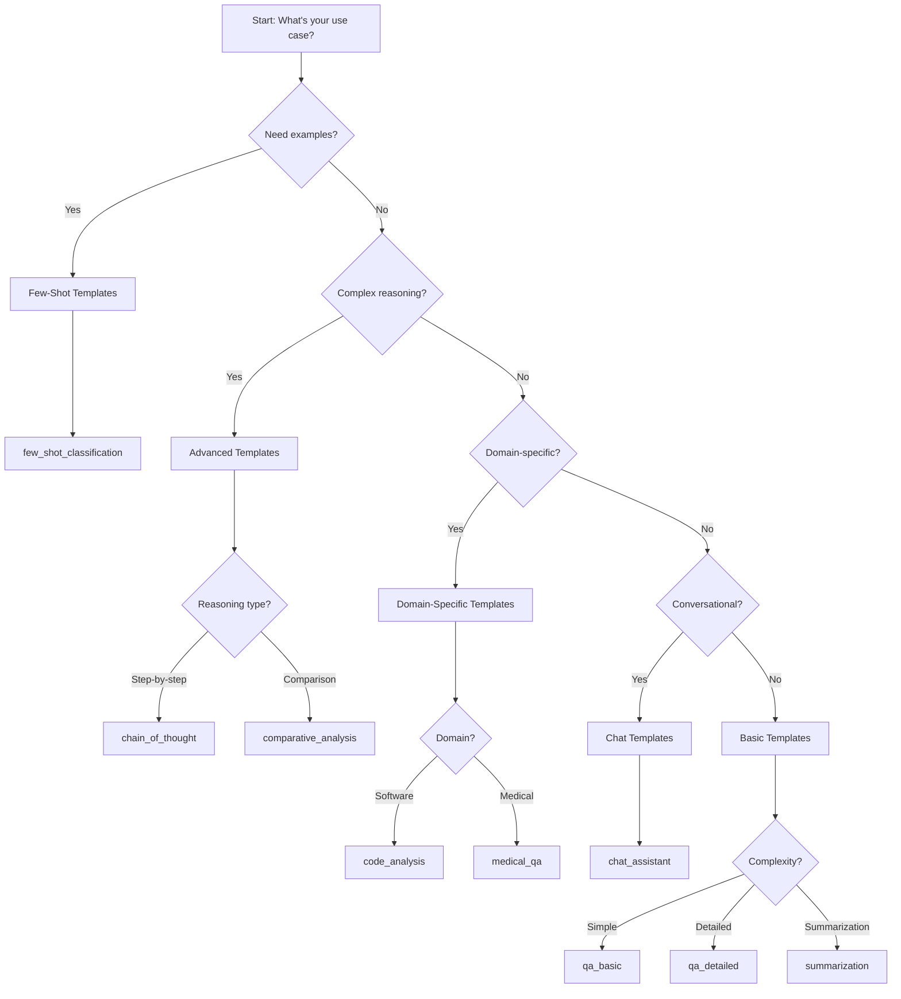

# LlamaFarm Prompts Management System

A sophisticated, configuration-driven prompt management system designed for RAG applications, chatbots, and complex AI workflows. Built with best practices, CLI-first design, and seamless integration capabilities.

## 🎯 Overview

The LlamaFarm Prompts System provides intelligent prompt template management with adaptive selection strategies, global prompt orchestration, and comprehensive CLI tooling. It's designed to scale from simple Q&A to complex multi-domain AI applications.

### Key Features

- **🧠 Intelligent Template Selection**: Context-aware strategies for optimal prompt routing
- **🌍 Global Prompts**: System-wide behavior modification and consistency
- **🛠️ Comprehensive CLI**: 25+ commands for template and strategy management
- **⚡ Performance Optimized**: Caching, validation, and efficient execution
- **🔧 Extensible Architecture**: Plugin-based strategies and custom filters
- **📊 Monitoring & Analytics**: Detailed metrics and A/B testing capabilities
- **🔄 RAG Integration**: Purpose-built for retrieval-augmented generation

## 📁 Architecture Overview

```
prompts/
├── prompts/                 # Core system code
│   ├── models/             # Data models (templates, strategies, config)
│   ├── core/               # Core engines (template, strategy, registry)
│   ├── utils/              # Utilities (loaders, builders, helpers)
│   └── cli.py              # Command-line interface
├── templates/              # Individual template files by category
│   ├── basic/              # Simple Q&A and text generation
│   ├── chat/               # Conversational templates
│   ├── few_shot/           # Example-based learning templates
│   ├── advanced/           # Complex reasoning templates
│   └── domain_specific/    # Specialized domain templates
├── strategies/             # Strategy documentation and examples
├── config/                 # Generated configuration files
├── test_data/             # Sample data and test contexts
└── utils/                 # Utility scripts and documentation
```

## 🚀 Quick Start

### Installation & Setup

```bash
# Install dependencies
uv sync --dev

# Run setup and demo
./setup_and_demo.sh

# Validate installation
uv run python -m prompts.cli stats
```

### Basic Usage

```bash
# List all available templates
uv run python -m prompts.cli template list

# Execute a simple query
uv run python -m prompts.cli execute "What is machine learning?" --show-details

# Test a specific template
uv run python -m prompts.cli template test qa_basic \
  --variables '{"query":"What is AI?", "context":[{"title":"AI Guide", "content":"AI is..."}]}'
```

## 🎯 Practical Examples & Customization Guide

### Real-World Scenarios

#### 1. Building a Customer Support Bot

```bash
# Scenario: Need friendly, helpful responses with context awareness

# First, explore available templates
uv run python -m prompts.cli template list --domain general

# Use the chat assistant template for conversational responses
uv run python -m prompts.cli execute "How do I reset my password?" \
  --template chat_assistant \
  --variables '{"tone": "friendly", "company": "TechCorp"}'

# Create a custom support template
cat > templates/domain_specific/customer_support.json << 'EOF'
{
  "template_id": "customer_support",
  "name": "Customer Support Assistant",
  "type": "chat",
  "template": "You are a helpful customer support agent for {{company}}.\n\nCustomer Query: {{query}}\n\nContext:\n{{context}}\n\nProvide a clear, empathetic response that:\n1. Acknowledges the customer's issue\n2. Provides step-by-step help\n3. Offers additional resources\n\nResponse:",
  "input_variables": ["query", "company"],
  "optional_variables": ["context", "customer_history"],
  "metadata": {
    "use_case": "Customer support interactions",
    "domain": "support",
    "complexity": "medium",
    "tags": ["support", "customer-service", "help"]
  }
}
EOF

# Test your new template
uv run python -m prompts.cli template test customer_support \
  --variables '{"query": "I cant login", "company": "TechCorp"}'
```

#### 2. Medical Information System

```bash
# Scenario: Need accurate, cautious medical information with disclaimers

# Use the medical Q&A template with appropriate context
uv run python -m prompts.cli execute "What are symptoms of diabetes?" \
  --template medical_qa \
  --variables '{"domain": "medical", "disclaimer": true}'

# For complex medical queries, use chain of thought
uv run python -m prompts.cli execute "Analyze drug interactions between aspirin and warfarin" \
  --template chain_of_thought \
  --variables '{"domain": "medical", "context": [{"title": "Drug Database", "content": "..."}]}'
```

#### 3. Code Review Assistant

```bash
# Scenario: Automated code review with specific focus areas

# Basic code analysis
uv run python -m prompts.cli execute "Review this Python function for security issues" \
  --template code_analysis \
  --variables '{"code": "def login(username, password):\n    query = f\"SELECT * FROM users WHERE name={username}\"", "focus": "security"}'

# Comparative code analysis
uv run python -m prompts.cli execute "Compare these two implementations" \
  --template comparative_analysis \
  --variables '{"option_a": "iterative_solution.py", "option_b": "recursive_solution.py"}'
```

### Strategy Customization

#### Understanding Strategy Selection

```bash
# View current strategies
uv run python -m prompts.cli strategy list

# Test how strategies select templates
uv run python -m prompts.cli strategy test rule_based_strategy \
  --test-file tests/data/strategy_test_cases.json
```

#### Creating Custom Strategies

```python
# Create a custom strategy for your domain
# File: strategies/custom_strategy.json
{
  "strategy_id": "domain_expert_strategy",
  "name": "Domain Expert Strategy",
  "type": "rule_based",
  "rules": [
    {
      "conditions": {
        "domain": "legal",
        "query_type": "contract"
      },
      "template_id": "legal_contract_analysis",
      "priority": 100
    },
    {
      "conditions": {
        "domain": "legal",
        "complexity": "high"
      },
      "template_id": "legal_reasoning",
      "priority": 90
    }
  ],
  "fallback_template": "qa_detailed",
  "enabled": true
}
```

#### Strategy Hierarchy Example

```bash
# Implement a multi-tier strategy system
# 1. Domain-specific routing
# 2. Complexity-based selection
# 3. Context-aware fallbacks

# Test your strategy hierarchy
uv run python -m prompts.cli execute "Explain GDPR compliance requirements" \
  --strategy domain_expert_strategy \
  --variables '{"domain": "legal", "region": "EU"}' \
  --show-details
```

### Template Modification Patterns

#### 1. Adding Context-Aware Behavior

```python
# Original template (basic)
{
  "template": "Answer the question: {{query}}\n\nAnswer:"
}

# Enhanced with context awareness
{
  "template": "Based on the following context:\n[{{doc.title}}]: {{doc.content}}\n\n\nQuestion: {{query}}\n\nProvide a detailed answer using the provided context:"
}
```

#### 2. Multi-Language Support

```bash
# Create language-specific template variants
cp templates/basic/qa_basic.json templates/basic/qa_basic_es.json

# Edit for Spanish
# Modify the template content to Spanish prompts
# Add language detection in your strategy
```

#### 3. Dynamic Template Selection

```python
# Create templates for different user expertise levels
# beginner_explanation.json
{
  "template": "Explain {{topic}} in simple terms, as if explaining to someone new to the field:\n\n"
}

# expert_analysis.json
{
  "template": "Provide an in-depth technical analysis of {{topic}}, including:\n- Advanced concepts\n- Current research\n- Technical implications\n\n"
}

# Use with dynamic selection
uv run python -m prompts.cli execute "Explain quantum computing" \
  --template beginner_explanation \
  --variables '{"topic": "quantum computing", "user_level": "beginner"}'
```

### Global Prompt Customization

#### Company-Wide Standards

```bash
# Add your organization's standards
uv run python -m prompts.cli global-prompt create \
  --id company_guidelines \
  --name "Company AI Guidelines" \
  --system "Always follow ACME Corp guidelines: Be professional, accurate, and helpful. Never disclose proprietary information." \
  --applies-to "*" \
  --priority 50

# Add domain-specific overrides
uv run python -m prompts.cli global-prompt create \
  --id legal_compliance \
  --name "Legal Compliance" \
  --prefix "LEGAL NOTICE: This is not legal advice. Consult qualified counsel.\n\n" \
  --applies-to "legal_*" \
  --priority 10
```

### Integration Examples

#### 1. RAG Pipeline Integration

```python
# Example: Integrate with your RAG system
import asyncio
from prompts.core.prompt_system import PromptSystem
from prompts.models.config import PromptConfig

async def rag_query(question: str, retrieved_docs: list):
    # Load prompt system
    config = PromptConfig.from_file('config/default_prompts.json')
    prompt_system = PromptSystem(config)

    # Execute with context
    result = prompt_system.execute_prompt(
        query=question,
        variables={
            "context": retrieved_docs,
            "source_citations": True
        },
        template_override="qa_detailed"  # or let strategy decide
    )

    return result.rendered_prompt

# Use in your RAG pipeline
docs = retrieve_documents("What is quantum entanglement?")
prompt = await rag_query("What is quantum entanglement?", docs)
# Send to LLM...
```

#### 2. A/B Testing Templates

```bash
# Test which template performs better
# Create variant templates
cp templates/basic/qa_basic.json templates/basic/qa_basic_v2.json
# Edit qa_basic_v2.json with improvements

# Run A/B test
uv run python -m prompts.cli execute "Explain machine learning" \
  --template qa_basic > response_a.txt

uv run python -m prompts.cli execute "Explain machine learning" \
  --template qa_basic_v2 > response_b.txt

# Evaluate both
uv run python -m prompts.cli evaluate "$(cat response_a.txt)" \
  --query "Explain machine learning" \
  --criteria "clarity,completeness" \
  --output-format score > score_a.txt

uv run python -m prompts.cli evaluate "$(cat response_b.txt)" \
  --query "Explain machine learning" \
  --criteria "clarity,completeness" \
  --output-format score > score_b.txt
```

### Best Practices for Customization

1. **Start with existing templates**: Copy and modify rather than starting from scratch
2. **Test incrementally**: Use the CLI test commands after each change
3. **Document your templates**: Add clear metadata and use cases
4. **Version control**: Track template changes in git
5. **Benchmark performance**: Use the benchmark command to ensure changes don't degrade performance

```bash
# Before and after benchmarking
uv run python -m prompts.cli benchmark --templates --iterations 20 > before.json
# Make your changes...
uv run python -m prompts.cli benchmark --templates --iterations 20 > after.json
# Compare results
```

## 📝 Template Types & When to Use Them

Based on LangChain's prompt template patterns, our system provides specialized templates for different use cases:

### 1. Basic Templates (`basic/`)

**Purpose**: Simple variable substitution for straightforward tasks.

**When to Use**:

- Single-turn interactions
- Basic Q&A scenarios
- Document summarization
- Simple text generation
- No conversation history needed

**Available Templates**:

#### `qa_basic` - Basic Question Answering

```bash
# CLI Usage
uv run python -m prompts.cli template show qa_basic --show-content

# Execute with context
uv run python -m prompts.cli execute "What is photosynthesis?" \
  --template qa_basic \
  --variables '{"context":[{"title":"Biology","content":"Photosynthesis is..."}]}'
```

**Template Structure**:

```jinja2
Based on the following context:

{{ context | format_documents }}

Question: {{ query }}

Answer:
```

#### `qa_detailed` - Comprehensive Q&A

```bash
# For complex questions requiring detailed analysis
uv run python -m prompts.cli execute "How does climate change affect biodiversity?" \
  --template qa_detailed \
  --show-details
```

#### `summarization` - Document Summarization

```bash
# Summarize documents
uv run python -m prompts.cli execute "Summarize the key findings" \
  --template summarization \
  --variables '{"context":[{"title":"Research Paper","content":"Long research content..."}]}'
```

### 2. Chat Templates (`chat/`)

**Purpose**: Multi-turn conversations with message-based structure.

**When to Use**:

- Chatbots and virtual assistants
- Customer support scenarios
- Interactive tutoring
- Conversational AI applications
- Context-aware responses

#### `chat_assistant` - Conversational Assistant

```bash
# Interactive chat with optional context
uv run python -m prompts.cli execute "Hello! Can you help me understand quantum computing?" \
  --template chat_assistant \
  --show-details
```

**Template Features**:

- Conditional context inclusion
- Conversational tone
- Dynamic response adaptation

### 3. Few-Shot Templates (`few_shot/`)

**Purpose**: Pattern learning through examples.

**When to Use**:

- Classification tasks
- Pattern recognition
- Custom formatting requirements
- Style mimicking
- Domain-specific language tasks
- Consistent output structure needed

#### `few_shot_classification` - Example-Based Classification

```bash
# Classify text using examples
uv run python -m prompts.cli execute "The quarterly earnings exceeded expectations" \
  --template few_shot_classification \
  --variables '{
    "examples": "• \"Meeting scheduled for Tuesday\" → Business\n• \"Happy birthday!\" → Personal\n• \"Order shipped\" → Notification"
  }'
```

**Use Cases**:

- Email categorization
- Document classification
- Sentiment analysis
- Intent recognition

### 4. Advanced Templates (`advanced/`)

**Purpose**: Complex reasoning and analytical tasks.

**When to Use**:

- Multi-step reasoning required
- Comparative analysis
- Complex problem solving
- Structured analytical output
- Chain-of-thought reasoning

#### `chain_of_thought` - Step-by-Step Reasoning

```bash
# Complex analytical reasoning
uv run python -m prompts.cli execute "Why might renewable energy adoption vary between countries?" \
  --template chain_of_thought \
  --variables '{"context":[{"title":"Energy Report","content":"Economic factors, policy differences..."}]}'
```

**Template Pattern**:

```jinja2
Context: {{ context | format_documents }}

Question: {{ query }}

Let me work through this step by step:

1. **Initial Analysis**: [First examination of the context]
2. **Key Factors**: [Identification of important elements]
3. **Relationships**: [How factors connect]
4. **Conclusion**: [Final reasoning and answer]
```

#### `comparative_analysis` - Document Comparison

```bash
# Compare multiple documents or concepts
uv run python -m prompts.cli execute "Compare cloud vs on-premises infrastructure" \
  --template comparative_analysis \
  --variables '{
    "context": [
      {"title": "Cloud Computing", "content": "Scalable, cost-effective..."},
      {"title": "On-Premises", "content": "Complete control, security..."}
    ]
  }'
```

### 5. Domain-Specific Templates (`domain_specific/`)

**Purpose**: Specialized templates for particular domains.

**When to Use**:

- Domain expertise required
- Specialized terminology
- Compliance requirements
- Professional contexts
- Industry-specific analysis

#### `code_analysis` - Software Development

```bash
# Code review and analysis
uv run python -m prompts.cli execute "Review this function for improvements" \
  --template code_analysis \
  --variables '{
    "context": "def fibonacci(n):\n    if n <= 1:\n        return n\n    return fibonacci(n-1) + fibonacci(n-2)"
  }'
```

#### `medical_qa` - Healthcare Context

```bash
# Medical information analysis (with appropriate disclaimers)
uv run python -m prompts.cli execute "What are the symptoms of hypertension?" \
  --template medical_qa \
  --variables '{"context":[{"title":"Medical Reference","content":"Hypertension symptoms include..."}]}'
```

## 🧠 Intelligent Template Selection

The system automatically selects optimal templates based on context, user role, and query characteristics.

### Strategy Types

#### 1. Context-Aware Strategy

Analyzes domain, user role, and complexity to select templates:

```bash
# Test context-aware selection
uv run python -c "
from prompts.models.config import PromptConfig
from prompts.models.context import PromptContext
from prompts.core.prompt_system import PromptSystem

config = PromptConfig.from_file('config/default_prompts.json')
system = PromptSystem(config)

# Medical domain query
context = PromptContext(
    query='What are diabetes symptoms?',
    domain='medical',
    user_role='physician'
)

result = system.execute_prompt('What are diabetes symptoms?', context)
print(f'Selected template: {result.selected_template_id}')
print(f'Strategy: {result.selected_strategy_id}')
"
```

#### 2. Rule-Based Strategy

Uses explicit rules for template routing:

```bash
# Test rule-based routing
uv run python -m prompts.cli strategy test rule_based_strategy --test-file test_data/sample_contexts.json
```

#### 3. Static Strategy

Always returns the same template (useful for testing):

```bash
# Force specific template
uv run python -m prompts.cli execute "Any query" --strategy default_static --template qa_basic
```

## 🌍 Global Prompts System

Global prompts modify system behavior across all templates:

### Available Global Prompts

#### System Context

```bash
# View global prompts
uv run python -m prompts.cli global-prompt list

# Test with global prompts applied
uv run python -m prompts.cli execute "Explain quantum computing" --show-details
```

#### Quality Guidelines

Ensures consistent response quality:

- Accuracy requirements
- Clarity standards
- Appropriate length

#### Domain-Specific Context

Adds specialized knowledge for domains like medical, legal, technical.

## 📊 Template Decision Guide

### Quick Selection Chart

| Use Case               | Template Type   | Example Template          | When to Use                                     |
| ---------------------- | --------------- | ------------------------- | ----------------------------------------------- |
| Simple Q&A             | Basic           | `qa_basic`                | Straightforward questions with context          |
| Detailed Analysis      | Basic           | `qa_detailed`             | Complex questions needing comprehensive answers |
| Chat/Conversation      | Chat            | `chat_assistant`          | Interactive, multi-turn conversations           |
| Pattern Learning       | Few-Shot        | `few_shot_classification` | Need examples to guide model behavior           |
| Step-by-step Reasoning | Advanced        | `chain_of_thought`        | Complex logical reasoning required              |
| Document Comparison    | Advanced        | `comparative_analysis`    | Analyzing multiple documents/concepts           |
| Code Review            | Domain-Specific | `code_analysis`           | Software development tasks                      |
| Medical Analysis       | Domain-Specific | `medical_qa`              | Healthcare-related queries                      |
| Document Summary       | Basic           | `summarization`           | Condensing large content                        |

### Decision Tree



## 🛠️ Advanced CLI Usage

### Template Management

```bash
# Create new template interactively
uv run python -m prompts.cli template create --interactive

# Import templates from file
uv run python -m prompts.cli template import --file custom_templates.json

# Validate all templates
uv run python -m prompts.cli template validate --all

# Search templates
uv run python -m prompts.cli template search "analysis"

# Export templates
uv run python -m prompts.cli template export --ids qa_basic,qa_detailed --format json
```

### Strategy Management

```bash
# List all strategies
uv run python -m prompts.cli strategy list

# Test strategy performance
uv run python -m prompts.cli strategy test context_aware_strategy

# Compare strategies
uv run python -m prompts.cli strategy compare context_aware_strategy rule_based_strategy

# Strategy statistics
uv run python -m prompts.cli strategy stats context_aware_strategy
```

### Configuration Management

```bash
# Validate configuration
uv run python -m prompts.cli validate-config

# Generate new configuration
uv run python generate_config.py --validate

# System statistics
uv run python -m prompts.cli stats

# Performance metrics
uv run python -m prompts.cli metrics --detailed
```

## 🔧 Customization & Extension

### Creating Custom Templates

1. **Create template file** in appropriate category directory:

```json
{
  "template_id": "custom_analysis",
  "name": "Custom Analysis Template",
  "type": "advanced",
  "template": "Analyze the following:\n\n{{ context | format_documents }}\n\nFocus on: {{ focus_area }}\n\nAnalysis:",
  "input_variables": ["context", "focus_area"],
  "optional_variables": [],
  "metadata": {
    "use_case": "custom_analysis",
    "complexity": "medium",
    "domain": "general",
    "description": "Custom template for focused analysis",
    "tags": ["analysis", "custom", "focused"],
    "author": "Your Name"
  },
  "validation_rules": {
    "context": { "type": "list", "required": true },
    "focus_area": { "type": "str", "required": true }
  }
}
```

2. **Regenerate configuration**:

```bash
uv run python generate_config.py --validate
```

3. **Test your template**:

```bash
uv run python -m prompts.cli template test custom_analysis \
  --variables '{"context":[{"title":"Data","content":"..."}], "focus_area":"trends"}'
```

### Creating Custom Strategies

Add strategy configuration to your prompt config:

```json
{
  "strategy_id": "domain_priority",
  "name": "Domain Priority Strategy",
  "type": "rule_based",
  "description": "Prioritizes domain-specific templates",
  "rules": [
    {
      "rule_id": "medical_priority",
      "condition": {
        "field": "domain",
        "operator": "equals",
        "value": "medical"
      },
      "template_id": "medical_qa",
      "priority": 100
    },
    {
      "rule_id": "code_priority",
      "condition": {
        "field": "domain",
        "operator": "equals",
        "value": "software"
      },
      "template_id": "code_analysis",
      "priority": 90
    }
  ],
  "fallback_template": "qa_basic"
}
```

### Adding Custom Filters

Extend the template engine with custom Jinja2 filters:

```python
# In prompts/core/template_engine.py
def custom_filter(text: str, param: str) -> str:
    """Your custom filter logic"""
    return processed_text

# Register the filter
self.env.filters['custom_filter'] = custom_filter
```

## 📈 Performance & Monitoring

### Metrics & Analytics

```bash
# System performance
uv run python -m prompts.cli stats

# Template usage statistics
uv run python -m prompts.cli template stats

# Strategy performance comparison
uv run python -m prompts.cli strategy compare --metrics accuracy,speed,user_satisfaction
```

### A/B Testing

Test different templates or strategies:

```python
# Example A/B test configuration
{
  "ab_test": {
    "name": "qa_template_comparison",
    "variants": {
      "control": "qa_basic",
      "treatment": "qa_detailed"
    },
    "traffic_split": 0.5,
    "success_metrics": ["user_satisfaction", "response_quality"],
    "duration_days": 14
  }
}
```

## 🔄 Integration Patterns

### RAG Integration

```python
from prompts.core.prompt_system import PromptSystem
from prompts.models.context import PromptContext

# Initialize prompt system
config = PromptConfig.from_file('config/default_prompts.json')
prompt_system = PromptSystem(config)

# RAG workflow
def rag_query(query: str, retrieved_docs: List[Dict]) -> str:
    # Create context
    context = PromptContext(
        query=query,
        domain=infer_domain(query),
        user_role="general"
    )

    # Execute with retrieved documents
    result = prompt_system.execute_prompt(
        query=query,
        context=context,
        variables={"context": retrieved_docs}
    )

    return result.final_prompt, result.selected_template_id
```

### LangGraph Integration

```python
from langgraph import StateGraph, END
from prompts.core.prompt_system import PromptSystem

def create_prompt_workflow():
    workflow = StateGraph()

    workflow.add_node("analyze_query", analyze_query_node)
    workflow.add_node("select_template", select_template_node)
    workflow.add_node("execute_prompt", execute_prompt_node)

    workflow.set_entry_point("analyze_query")
    workflow.add_edge("analyze_query", "select_template")
    workflow.add_edge("select_template", "execute_prompt")
    workflow.add_edge("execute_prompt", END)

    return workflow.compile()
```

## 🧪 Testing & Validation

### Template Testing

```bash
# Validate template syntax
uv run python -m prompts.cli template validate qa_basic

# Test with sample data
uv run python -m prompts.cli template test qa_basic \
  --variables-file tests/data/qa_samples.json

# Performance testing
uv run python -m prompts.cli benchmark --templates --iterations 100
```

### Strategy Testing

```bash
# Test strategy logic
uv run python -m prompts.cli strategy test context_aware_strategy \
  --test-file tests/data/sample_contexts.json

# Validate all strategies
uv run python -m prompts.cli validate --strategies
```

### System Testing

```bash
# Run comprehensive system tests
uv run python -m prompts.cli test --all-templates
uv run python -m prompts.cli test --all-strategies

# Validate entire system
uv run python -m prompts.cli validate --all

# Benchmark system performance
uv run python -m prompts.cli benchmark --system --iterations 50 --output csv
```

### Response Evaluation

```bash
# Evaluate AI responses
uv run python -m prompts.cli evaluate "AI response text here" \
  --query "What is machine learning?" \
  --criteria "accuracy,completeness,clarity" \
  --template llm_judge

# Use RAG evaluation template
uv run python -m prompts.cli evaluate "Generated answer" \
  --query "Original question" \
  --template rag_evaluation \
  --context '[{"title": "Doc1", "content": "Retrieved content"}]'
```

## 🤝 Contributing

### Development Setup

```bash
# Clone and setup
git clone <repository>
cd prompts
uv sync --dev

# Run tests
uv run python -m pytest tests/ -v

# Code quality
uv run python -m black prompts/
uv run python -m isort prompts/
uv run python -m flake8 prompts/
```

### Contributing Guidelines

1. **Template Contributions**: Add templates to appropriate category directories
2. **Strategy Contributions**: Document strategy logic and use cases
3. **Testing**: Include comprehensive tests for new features
4. **Documentation**: Update documentation for changes
5. **Performance**: Consider performance impact of changes

## 📄 License

This project is licensed under the MIT License - see the LICENSE file for details.

## 🙏 Acknowledgments

- Built with [LangChain](https://langchain.com) prompt template patterns
- Inspired by best practices in prompt engineering
- Community contributions and feedback

---

**Ready to get started?** Run `./setup_and_demo.sh` to see the system in action!

For questions, issues, or contributions, please visit our [GitHub repository](https://github.com/llama-farm/prompts).
