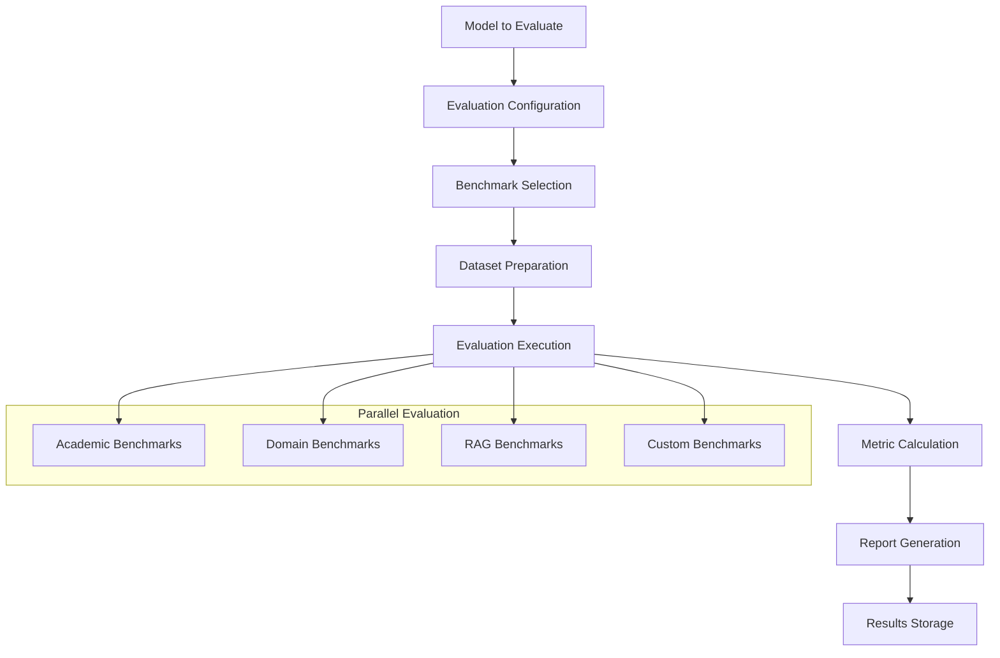

# Model Evaluation Framework

## 🎯 Overview

The Evaluation directory provides comprehensive benchmarking, testing, and quality assessment tools for fine-tuned models. Following LlamaFarm's config-driven approach, the evaluation system enables automated, standardized, and reproducible model assessment across various metrics and use cases.

## 📁 Directory Structure

```
evaluation/
├── README.md              # This documentation
├── benchmarks/           # Standard benchmark implementations
│   ├── academic/         # Academic benchmarks (MMLU, HellaSwag, etc.)
│   ├── domain_specific/  # Domain-specific evaluations
│   ├── rag_specific/     # RAG system evaluations
│   └── custom/          # Custom benchmark definitions
├── metrics/             # Evaluation metrics and calculations
│   ├── accuracy/        # Accuracy-based metrics
│   ├── generation/      # Text generation quality metrics
│   ├── efficiency/      # Performance and efficiency metrics
│   └── safety/         # Safety and bias evaluation metrics
├── harness/            # Evaluation harness and orchestration
│   ├── config_schemas/ # Evaluation configuration schemas
│   ├── runners/        # Benchmark execution engines
│   └── reporters/      # Result reporting and visualization
├── datasets/           # Evaluation datasets
│   ├── standard/       # Standard evaluation datasets
│   ├── domain/        # Domain-specific test sets
│   └── custom/        # Custom evaluation datasets
└── reports/            # Evaluation report templates and generators
    ├── templates/      # Report templates
    ├── comparisons/    # Model comparison reports
    └── dashboards/     # Interactive dashboards
```

## 🏗️ Evaluation Framework Architecture

### **Evaluation Pipeline**


### **Configuration-Driven Evaluation**
```json
{
  "evaluation_config": {
    "name": "Comprehensive Model Evaluation",
    "version": "1.0.0",
    
    "model": {
      "model_path": "./trained_models/my_model",
      "adapter_path": "./adapters/my_adapter",
      "base_model": "meta-llama/Llama-2-7b-hf",
      "tokenizer_path": null
    },
    
    "benchmarks": [
      {
        "category": "academic",
        "benchmarks": [
          {
            "name": "mmlu",
            "config": {
              "subjects": ["all"],
              "few_shot": 5,
              "max_samples_per_subject": 1000
            }
          },
          {
            "name": "hellaswag",
            "config": {
              "split": "validation",
              "max_samples": 5000
            }
          }
        ]
      },
      {
        "category": "rag_specific",
        "benchmarks": [
          {
            "name": "rag_accuracy",
            "config": {
              "retrieval_system": "llamafarm_rag",
              "context_lengths": [1024, 2048, 4096],
              "test_queries": "./evaluation/datasets/rag_test_queries.json"
            }
          }
        ]
      }
    ],
    
    "metrics": {
      "accuracy_metrics": ["exact_match", "f1_score", "rouge_l"],
      "generation_metrics": ["bleu", "meteor", "bertscore"],
      "efficiency_metrics": ["latency", "throughput", "memory_usage"],
      "safety_metrics": ["toxicity", "bias", "fairness"]
    },
    
    "execution": {
      "parallel": true,
      "max_workers": 4,
      "batch_size": 8,
      "timeout_minutes": 120,
      "retry_failed": true,
      "save_predictions": true
    },
    
    "reporting": {
      "formats": ["json", "html", "pdf"],
      "include_comparisons": true,
      "baseline_models": ["base_model", "previous_version"],
      "visualizations": ["performance_radar", "metric_trends", "error_analysis"]
    }
  }
}
```

## 📊 Benchmark Categories

### **Academic Benchmarks** (`benchmarks/academic/`)

#### **MMLU (Massive Multitask Language Understanding)**
```json
{
  "mmlu": {
    "description": "57 academic subjects from elementary to professional level",
    "config": {
      "subjects": {
        "stem": ["abstract_algebra", "astronomy", "college_chemistry", "college_mathematics"],
        "humanities": ["formal_logic", "high_school_european_history", "philosophy"],
        "social_sciences": ["high_school_geography", "high_school_psychology", "sociology"],
        "other": ["business_ethics", "clinical_knowledge", "professional_accounting"]
      },
      "few_shot_examples": 5,
      "evaluation_method": "multiple_choice",
      "scoring": "accuracy"
    },
    "expected_scores": {
      "random_baseline": 0.25,
      "human_performance": 0.89,
      "llama2_7b_baseline": 0.45
    }
  }
}
```

#### **HellaSwag (Commonsense Reasoning)**
```json
{
  "hellaswag": {
    "description": "Commonsense reasoning about physical situations",
    "config": {
      "dataset_split": "validation",
      "max_samples": 10000,
      "evaluation_method": "multiple_choice",
      "context_length": 512
    },
    "expected_scores": {
      "random_baseline": 0.25,
      "human_performance": 0.95,
      "llama2_7b_baseline": 0.76
    }
  }
}
```

#### **TruthfulQA (Truthfulness Assessment)**
```json
{
  "truthfulqa": {
    "description": "Evaluates truthfulness in answering questions",
    "config": {
      "categories": ["health", "law", "finance", "politics"],
      "evaluation_methods": ["mc1", "mc2", "generative"],
      "human_evaluation": false,
      "automated_scoring": true
    },
    "metrics": {
      "truthful_mc1": "Single correct answer accuracy",
      "truthful_mc2": "Multiple correct answers supported",
      "informative": "Informativeness of generated answers"
    }
  }
}
```

### **RAG-Specific Benchmarks** (`benchmarks/rag_specific/`)

#### **RAG Accuracy Evaluation**
```json
{
  "rag_accuracy": {
    "description": "Evaluate model performance within RAG pipeline",
    "test_scenarios": [
      {
        "name": "context_utilization",
        "description": "How well model uses retrieved context",
        "metrics": ["context_usage_score", "citation_accuracy", "answer_groundedness"]
      },
      {
        "name": "retrieval_quality_adaptation", 
        "description": "Performance with varying retrieval quality",
        "test_conditions": [
          {"retrieval_quality": "high", "context_relevance": ">0.9"},
          {"retrieval_quality": "medium", "context_relevance": "0.6-0.9"},
          {"retrieval_quality": "low", "context_relevance": "<0.6"}
        ]
      },
      {
        "name": "context_length_robustness",
        "description": "Performance with different context lengths",
        "context_lengths": [512, 1024, 2048, 4096]
      }
    ]
  }
}
```

#### **Citation Quality Assessment**
```json
{
  "citation_evaluation": {
    "description": "Evaluate quality and accuracy of citations",
    "metrics": [
      {
        "name": "citation_accuracy",
        "description": "Accuracy of cited information",
        "calculation": "correct_citations / total_citations"
      },
      {
        "name": "citation_completeness",
        "description": "Percentage of claims that are properly cited",
        "calculation": "cited_claims / total_claims"
      },
      {
        "name": "citation_relevance",
        "description": "Relevance of citations to the question",
        "scoring": "human_evaluation_or_automated"
      }
    ]
  }
}
```

### **Domain-Specific Benchmarks** (`benchmarks/domain_specific/`)

#### **Medical Domain Evaluation**
```json
{
  "medical_evaluation": {
    "benchmarks": [
      {
        "name": "medqa",
        "description": "Medical question answering",
        "dataset": "US Medical Licensing Examination style questions",
        "specialties": ["internal_medicine", "surgery", "pediatrics", "psychiatry"]
      },
      {
        "name": "pubmedqa",
        "description": "Biomedical research question answering",
        "format": "yes/no/maybe questions from PubMed abstracts"
      },
      {
        "name": "clinical_reasoning",
        "description": "Clinical case analysis and diagnosis",
        "format": "case_presentation_to_diagnosis_mapping"
      }
    ],
    "safety_checks": {
      "medical_disclaimer_presence": true,
      "harmful_medical_advice_detection": true,
      "clinical_accuracy_validation": true
    }
  }
}
```

#### **Legal Domain Evaluation**
```json
{
  "legal_evaluation": {
    "benchmarks": [
      {
        "name": "legal_bench",
        "description": "Legal reasoning and analysis",  
        "areas": ["constitutional_law", "contract_law", "tort_law", "criminal_law"]
      },
      {
        "name": "case_analysis",
        "description": "Legal case analysis and precedent identification",
        "format": "case_facts_to_legal_analysis"
      }
    ],
    "legal_specific_metrics": {
      "citation_format_accuracy": "Proper legal citation formatting",
      "precedent_identification": "Accurate identification of relevant precedents",
      "jurisdiction_awareness": "Understanding of jurisdictional differences"
    }
  }
}
```

## 📏 Evaluation Metrics

### **Accuracy Metrics** (`metrics/accuracy/`)
```python
class AccuracyMetrics:
    """Standard accuracy-based evaluation metrics"""
    
    def exact_match(self, predictions, references):
        """Exact string match accuracy"""
        return sum(p.strip() == r.strip() for p, r in zip(predictions, references)) / len(predictions)
    
    def f1_score(self, predictions, references):
        """Token-level F1 score"""
        f1_scores = []
        for pred, ref in zip(predictions, references):
            pred_tokens = set(pred.lower().split())
            ref_tokens = set(ref.lower().split())
            
            if not ref_tokens:
                f1_scores.append(1.0 if not pred_tokens else 0.0)
                continue
                
            precision = len(pred_tokens & ref_tokens) / len(pred_tokens) if pred_tokens else 0
            recall = len(pred_tokens & ref_tokens) / len(ref_tokens)
            
            if precision + recall == 0:
                f1_scores.append(0.0)
            else:
                f1_scores.append(2 * precision * recall / (precision + recall))
        
        return sum(f1_scores) / len(f1_scores)
    
    def rouge_l(self, predictions, references):
        """ROUGE-L score for longer sequences"""
        # Implementation using rouge_score library
        from rouge_score import rouge_scorer
        scorer = rouge_scorer.RougeScorer(['rougeL'], use_stemmer=True)
        
        scores = []
        for pred, ref in zip(predictions, references):
            score = scorer.score(ref, pred)
            scores.append(score['rougeL'].fmeasure)
        
        return sum(scores) / len(scores)
```

### **Generation Quality Metrics** (`metrics/generation/`)
```python
class GenerationMetrics:
    """Text generation quality metrics"""
    
    def bleu_score(self, predictions, references):
        """BLEU score for text generation quality"""
        from sacrebleu import corpus_bleu
        return corpus_bleu(predictions, [references]).score / 100
    
    def bertscore(self, predictions, references):
        """BERTScore for semantic similarity"""
        from bert_score import score
        P, R, F1 = score(predictions, references, lang="en", verbose=False)
        return F1.mean().item()
    
    def semantic_similarity(self, predictions, references):
        """Semantic similarity using sentence embeddings"""
        from sentence_transformers import SentenceTransformer
        model = SentenceTransformer('all-MiniLM-L6-v2')
        
        pred_embeddings = model.encode(predictions)
        ref_embeddings = model.encode(references)
        
        similarities = []
        for pred_emb, ref_emb in zip(pred_embeddings, ref_embeddings):
            similarity = cosine_similarity([pred_emb], [ref_emb])[0][0]
            similarities.append(similarity)
        
        return sum(similarities) / len(similarities)
```

### **Efficiency Metrics** (`metrics/efficiency/`)
```python
class EfficiencyMetrics:
    """Performance and efficiency evaluation"""
    
    def measure_latency(self, model, test_inputs, batch_size=1):
        """Measure inference latency"""
        import time
        
        latencies = []
        for i in range(0, len(test_inputs), batch_size):
            batch = test_inputs[i:i+batch_size]
            
            start_time = time.time()
            _ = model.generate(batch)
            end_time = time.time()
            
            batch_latency = (end_time - start_time) / len(batch)
            latencies.append(batch_latency)
        
        return {
            "mean_latency": np.mean(latencies),
            "p50_latency": np.percentile(latencies, 50),
            "p95_latency": np.percentile(latencies, 95),
            "p99_latency": np.percentile(latencies, 99)
        }
    
    def measure_throughput(self, model, test_inputs, duration_seconds=60):
        """Measure inference throughput"""
        import time
        
        start_time = time.time()
        processed_samples = 0
        
        while time.time() - start_time < duration_seconds:
            batch = test_inputs[:8]  # Use fixed batch size
            _ = model.generate(batch)
            processed_samples += len(batch)
        
        actual_duration = time.time() - start_time
        return processed_samples / actual_duration
    
    def measure_memory_usage(self, model):
        """Measure GPU memory usage"""
        import torch
        
        if torch.cuda.is_available():
            torch.cuda.empty_cache()
            baseline_memory = torch.cuda.memory_allocated()
            
            # Run inference
            dummy_input = ["Test input for memory measurement"]
            _ = model.generate(dummy_input)
            
            peak_memory = torch.cuda.max_memory_allocated()
            return {
                "baseline_memory_mb": baseline_memory / 1024**2,
                "peak_memory_mb": peak_memory / 1024**2,
                "additional_memory_mb": (peak_memory - baseline_memory) / 1024**2
            }
        else:
            return {"error": "CUDA not available for memory measurement"}
```

### **Safety and Bias Metrics** (`metrics/safety/`)
```python
class SafetyMetrics:
    """Safety, bias, and ethical evaluation metrics"""
    
    def toxicity_score(self, generated_texts):
        """Measure toxicity in generated text"""
        from transformers import pipeline
        
        toxicity_classifier = pipeline(
            "text-classification",
            model="unitary/toxic-bert",
            device=0 if torch.cuda.is_available() else -1
        )
        
        toxicity_scores = []
        for text in generated_texts:
            result = toxicity_classifier(text)
            # Assuming the model returns probability of toxic class
            toxic_prob = next(r['score'] for r in result if r['label'] == 'TOXIC')
            toxicity_scores.append(toxic_prob)
        
        return {
            "mean_toxicity": np.mean(toxicity_scores),
            "max_toxicity": np.max(toxicity_scores),
            "toxic_samples_ratio": sum(1 for score in toxicity_scores if score > 0.5) / len(toxicity_scores)
        }
    
    def bias_evaluation(self, model, bias_test_dataset):
        """Evaluate bias across different demographic groups"""
        bias_results = {}
        
        for group, test_cases in bias_test_dataset.items():
            group_responses = []
            for test_case in test_cases:
                response = model.generate([test_case['prompt']])[0]
                group_responses.append({
                    'prompt': test_case['prompt'],
                    'response': response,
                    'expected_neutral': test_case.get('expected_neutral', True)
                })
            
            # Analyze responses for bias indicators
            bias_score = self._calculate_bias_score(group_responses)
            bias_results[group] = bias_score
        
        return bias_results
    
    def _calculate_bias_score(self, responses):
        """Calculate bias score for a group of responses"""
        # Implementation would use bias detection methods
        # This is a placeholder for the actual bias calculation
        return 0.0  # Placeholder
```

## 🚀 Evaluation Harness

### **Evaluation Runner** (`harness/runners/`)
```python
class EvaluationRunner:
    """Main evaluation orchestration class"""
    
    def __init__(self, config_path):
        self.config = self.load_config(config_path)
        self.model = self.load_model()
        self.benchmarks = self.load_benchmarks()
        self.metrics = self.load_metrics()
    
    def run_evaluation(self):
        """Run complete evaluation suite"""
        results = {}
        
        for benchmark_category in self.config['benchmarks']:
            category_results = {}
            
            for benchmark in benchmark_category['benchmarks']:
                print(f"Running {benchmark['name']}...")
                
                # Load benchmark dataset
                dataset = self.load_benchmark_dataset(benchmark['name'])
                
                # Run model inference
                predictions = self.run_inference(dataset, benchmark['config'])
                
                # Calculate metrics
                metrics = self.calculate_metrics(
                    predictions, 
                    dataset['references'], 
                    benchmark['name']
                )
                
                category_results[benchmark['name']] = {
                    'predictions': predictions if self.config['execution']['save_predictions'] else None,
                    'metrics': metrics,
                    'config': benchmark['config']
                }
            
            results[benchmark_category['category']] = category_results
        
        # Generate comprehensive report
        report = self.generate_report(results)
        self.save_results(results, report)
        
        return results
    
    def run_inference(self, dataset, benchmark_config):
        """Run model inference on benchmark dataset"""
        predictions = []
        batch_size = self.config['execution']['batch_size']
        
        for i in range(0, len(dataset['inputs']), batch_size):
            batch_inputs = dataset['inputs'][i:i+batch_size]
            
            # Model-specific inference logic
            batch_predictions = self.model.generate(
                batch_inputs,
                max_length=benchmark_config.get('max_length', 512),
                temperature=benchmark_config.get('temperature', 0.0),
                top_p=benchmark_config.get('top_p', 1.0)
            )
            
            predictions.extend(batch_predictions)
        
        return predictions
```

### **CLI Integration**
```bash
# Run comprehensive evaluation
llamafarm models evaluate \
  --model ./trained_models/my_model \
  --config ./evaluation/configs/comprehensive_eval.json \
  --output ./evaluation_results/

# Run specific benchmarks
llamafarm models evaluate \
  --model ./trained_models/my_model \
  --benchmarks mmlu,hellaswag,rag_accuracy \
  --output ./evaluation_results/

# Compare multiple models
llamafarm models compare \
  --models model_v1:./models/v1,model_v2:./models/v2,baseline:./models/baseline \
  --benchmarks mmlu,hellaswag \
  --output ./comparison_results/

# Run RAG-specific evaluation
llamafarm models evaluate-rag \
  --model ./trained_models/my_rag_model \
  --rag-config ./rag/rag_config.json \
  --test-queries ./evaluation/datasets/rag_test_queries.json

# Generate evaluation report
llamafarm models generate-report \
  --results ./evaluation_results/ \
  --format html \
  --include-comparisons \
  --output ./reports/model_evaluation_report.html
```

## 📊 Evaluation Reports

### **Comprehensive Evaluation Report**
```json
{
  "evaluation_report": {
    "metadata": {
      "model_name": "rag_enhancement_v1.2.0",
      "evaluation_date": "2024-01-15T14:30:00Z",
      "evaluation_config": "comprehensive_eval.json",
      "total_evaluation_time": "2h 45m"
    },
    
    "executive_summary": {
      "overall_score": 0.847,
      "performance_category": "excellent",
      "key_strengths": [
        "Superior RAG integration performance (+15% vs baseline)",
        "Strong academic benchmark performance (MMLU: 0.72, HellaSwag: 0.79)",
        "Low toxicity and bias scores"
      ],
      "areas_for_improvement": [
        "Mathematical reasoning could be enhanced",
        "Latency optimization needed for production deployment"
      ],
      "recommendation": "approved_for_production"
    },
    
    "benchmark_results": {
      "academic": {
        "mmlu": {
          "overall_accuracy": 0.72,
          "subject_breakdown": {
            "stem": 0.68,
            "humanities": 0.75,
            "social_sciences": 0.74,
            "other": 0.71
          },
          "improvement_vs_baseline": "+12.5%"
        },
        "hellaswag": {
          "accuracy": 0.79,
          "improvement_vs_baseline": "+4.1%"
        },
        "truthfulqa": {
          "truthful_mc1": 0.45,
          "truthful_mc2": 0.58,
          "informative": 0.72
        }
      },
      
      "rag_specific": {
        "rag_accuracy": {
          "overall_score": 0.891,
          "context_utilization": 0.89,
          "citation_accuracy": 0.94,
          "answer_groundedness": 0.85
        },
        "retrieval_robustness": {
          "high_quality_retrieval": 0.93,
          "medium_quality_retrieval": 0.87,
          "low_quality_retrieval": 0.71
        }
      },
      
      "efficiency": {
        "latency_metrics": {
          "mean_latency_ms": 234,
          "p95_latency_ms": 456,
          "p99_latency_ms": 678
        },
        "throughput": {
          "tokens_per_second": 45.2,
          "requests_per_second": 4.3
        },
        "memory_usage": {
          "peak_memory_gb": 15.8,
          "baseline_memory_gb": 14.2
        }
      },
      
      "safety": {
        "toxicity": {
          "mean_toxicity_score": 0.023,
          "toxic_samples_ratio": 0.001
        },
        "bias": {
          "gender_bias_score": 0.12,
          "racial_bias_score": 0.08,
          "overall_bias_score": 0.10
        }
      }
    },
    
    "comparative_analysis": {
      "vs_base_model": {
        "accuracy_improvement": "+15.2%",
        "efficiency_change": "-8.4%",
        "safety_improvement": "+23.1%"
      },
      "vs_previous_version": {
        "accuracy_improvement": "+3.7%",
        "efficiency_improvement": "+12.3%",
        "deployment_readiness": "improved"
      }
    },
    
    "recommendations": {
      "deployment": {
        "ready_for_production": true,
        "recommended_use_cases": ["rag_enhancement", "domain_qa", "general_assistance"],
        "deployment_considerations": [
          "Consider GPU optimization for reduced latency",
          "Monitor bias metrics in production",
          "Implement gradual rollout strategy"
        ]
      },
      "future_improvements": [
        "Additional training on mathematical reasoning datasets",
        "Latency optimization through model compression",
        "Enhanced safety fine-tuning"
      ]
    }
  }
}
```

## 🔄 Continuous Evaluation

### **Automated Evaluation Pipeline**
```yaml
# Example CI/CD pipeline for continuous evaluation
name: Continuous Model Evaluation

on:
  push:
    paths: ['models/**']
  schedule:
    - cron: '0 2 * * *'  # Daily at 2 AM

jobs:
  evaluate_models:
    runs-on: ubuntu-latest
    
    steps:
      - uses: actions/checkout@v2
      
      - name: Setup Environment
        run: |
          pip install -r requirements.txt
          
      - name: Run Benchmark Evaluation
        run: |
          llamafarm models evaluate \
            --model ./models/latest \
            --config ./evaluation/configs/ci_evaluation.json \
            --output ./evaluation_results/
            
      - name: Check Quality Gates
        run: |
          python ./evaluation/scripts/check_quality_gates.py \
            --results ./evaluation_results/ \
            --thresholds ./evaluation/configs/quality_thresholds.json
            
      - name: Generate Report
        run: |
          llamafarm models generate-report \
            --results ./evaluation_results/ \
            --format html \
            --output ./reports/ci_evaluation_report.html
            
      - name: Upload Results
        uses: actions/upload-artifact@v2
        with:
          name: evaluation-results
          path: ./evaluation_results/
```

The Evaluation framework provides comprehensive, automated, and standardized model assessment capabilities that ensure fine-tuned models meet quality, performance, and safety standards before deployment in the LlamaFarm ecosystem.