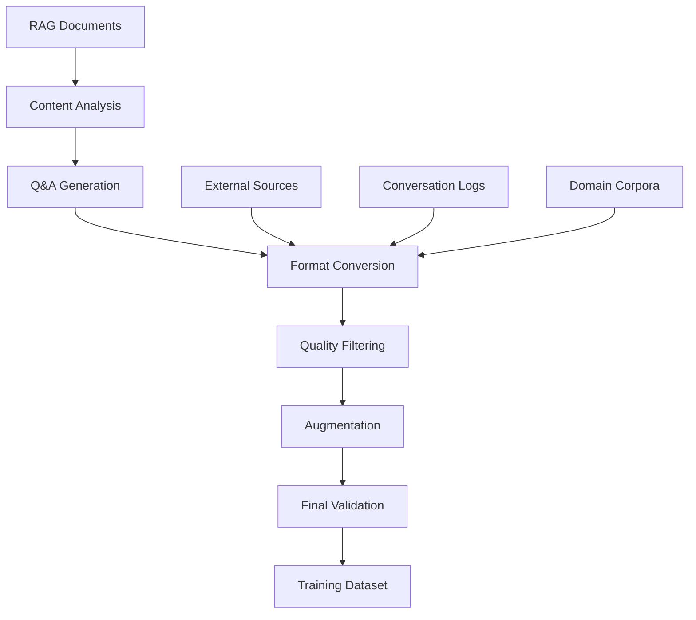

# Dataset Creation & Management

## 🎯 Overview

The datasets directory provides comprehensive tools for creating, managing, and quality-controlling training datasets for fine-tuning. Following LlamaFarm's config-driven approach, the system automates dataset creation from existing RAG documents and other data sources while ensuring high quality and format consistency.

## 📁 Directory Structure

```
datasets/
├── creation/           # Dataset generation tools and strategies
│   ├── README.md      # Dataset creation methods and tools
│   ├── rag_to_qa/     # Convert RAG documents to Q&A pairs
│   ├── synthetic/     # Synthetic data generation
│   ├── conversation/ # Conversation data extraction
│   └── domain_specific/ # Domain-specific dataset creation
├── formats/           # Data format converters and processors
│   ├── README.md     # Format specifications and converters
│   ├── alpaca/       # Alpaca format handling
│   ├── chatml/       # ChatML format processing
│   ├── sharegpt/     # ShareGPT format support
│   └── custom/       # Custom format definitions
├── quality_control/   # Dataset validation and quality metrics
│   ├── README.md     # Quality control framework
│   ├── filters/      # Content filtering and validation
│   ├── metrics/      # Quality assessment metrics
│   └── validation/   # Dataset validation tools
└── augmentation/     # Data augmentation techniques
    ├── README.md     # Augmentation strategies
    ├── paraphrasing/ # Text paraphrasing methods
    ├── backtranslation/ # Back-translation augmentation
    └── synthetic_variations/ # Synthetic variations
```

## 🔄 Dataset Creation Pipeline

### **Automated Dataset Creation Flow**


### **Configuration-Driven Creation**
```json
{
  "dataset_creation": {
    "name": "rag_enhancement_dataset_v1",
    "version": "1.0.0",
    
    "sources": [
      {
        "type": "rag_documents",
        "path": "./rag/data/",
        "include_metadata": true,
        "filters": {
          "min_length": 100,
          "domains": ["medical", "technical"],
          "file_types": ["pdf", "txt"]
        }
      },
      {
        "type": "conversation_logs",
        "path": "./logs/user_interactions.jsonl",
        "extract_successful_only": true
      }
    ],
    
    "generation": {
      "method": "synthetic_qa",
      "model": "gpt-4o-mini-turbo",
      "questions_per_document": 3,
      "question_types": ["factual", "analytical", "summarization"],
      "context_window": 2048,
      "temperature": 0.8
    },
    
    "format": {
      "output_format": "alpaca",
      "instruction_templates": {
        "factual": "Answer the following question based on the provided context:",
        "analytical": "Analyze the following information and provide insights:",
        "summarization": "Summarize the key points from the following text:"
      }
    },
    
    "quality_control": {
      "filters": {
        "min_quality_score": 0.7,
        "max_toxicity": 0.1,
        "language": "en",
        "remove_duplicates": true
      },
      "validation": {
        "human_review_sample": 0.05,
        "automated_checks": ["coherence", "factuality", "relevance"]
      }
    },
    
    "augmentation": {
      "enabled": true,
      "methods": ["paraphrasing", "synthetic_variations"],
      "augmentation_ratio": 0.3,
      "preserve_original": true
    },
    
    "output": {
      "train_split": 0.8,
      "validation_split": 0.15,
      "test_split": 0.05,
      "shuffle": true,
      "output_path": "./datasets/rag_enhancement_v1/"
    }
  }
}
```

## 🏭 Dataset Creation Methods

### **1. RAG-to-QA Conversion** (`creation/rag_to_qa/`)

**Purpose**: Convert existing RAG document corpus into question-answer training pairs

**Process**:
1. **Document Analysis**: Extract content, metadata, and structure
2. **Question Generation**: Create diverse questions based on content
3. **Answer Generation**: Generate comprehensive answers using context
4. **Quality Validation**: Ensure question-answer coherence and accuracy

**Configuration Example**:
```json
{
  "rag_to_qa": {
    "document_source": "./rag/data/chroma_db/",
    "generation_model": "gpt-4",
    "questions_per_chunk": 2,
    "question_strategies": [
      {
        "type": "factual_extraction",
        "weight": 0.4,
        "prompt": "Generate factual questions that can be answered directly from the text"
      },
      {
        "type": "analytical_reasoning", 
        "weight": 0.3,
        "prompt": "Create questions that require analysis and reasoning about the content"
      },
      {
        "type": "summarization",
        "weight": 0.3,
        "prompt": "Generate questions asking for summaries or key insights"
      }
    ],
    "context_preservation": {
      "include_document_metadata": true,
      "preserve_citations": true,
      "max_context_length": 1500
    }
  }
}
```

### **2. Synthetic Data Generation** (`creation/synthetic/`)

**Purpose**: Generate diverse synthetic training examples to augment real data

**Methods**:
- **LLM-Based Generation**: Use large models to create variations
- **Template-Based**: Fill templates with different content
- **Rule-Based**: Generate examples following specific rules
- **Adversarial Generation**: Create challenging examples

**Configuration Example**:
```json
{
  "synthetic_generation": {
    "base_examples": "./seed_data/base_examples.json",
    "generation_model": "gpt-4o-mini-turbo",
    "diversity_settings": {
      "temperature": 0.9,
      "top_p": 0.95,
      "frequency_penalty": 0.1
    },
    "variation_strategies": [
      {
        "name": "context_variation",
        "description": "Generate different contexts for same questions",
        "enabled": true,
        "ratio": 0.4
      },
      {
        "name": "question_rephrasing",
        "description": "Rephrase questions while maintaining intent",
        "enabled": true,
        "ratio": 0.3
      },
      {
        "name": "answer_expansion",
        "description": "Generate more detailed or concise answers",
        "enabled": true,
        "ratio": 0.3
      }
    ],
    "quality_thresholds": {
      "coherence_score": 0.8,
      "relevance_score": 0.7,
      "uniqueness_threshold": 0.9
    }
  }
}
```

### **3. Conversation Data Extraction** (`creation/conversation/`)

**Purpose**: Extract training patterns from user interaction logs

**Sources**:
- Chat logs from RAG system usage
- Customer support conversations
- Interactive AI sessions
- Human feedback data

**Configuration Example**:
```json
{
  "conversation_extraction": {
    "sources": [
      {
        "type": "llamafarm_logs",
        "path": "./logs/rag_interactions.jsonl",
        "filters": {
          "successful_only": true,
          "min_user_rating": 4,
          "exclude_errors": true
        }
      }
    ],
    "extraction_rules": {
      "conversation_turn_limit": 5,
      "extract_context": true,
      "include_user_feedback": true,
      "anonymize_pii": true
    },
    "formatting": {
      "preserve_conversation_flow": true,
      "extract_single_turns": true,
      "include_system_context": true
    }
  }
}
```

## 📊 Data Formats Support

### **Standard Formats** (`formats/`)

#### **Alpaca Format** (`formats/alpaca/`)
Most popular instruction-following format:
```json
{
  "instruction": "Answer the following question based on the context:",
  "input": "Context: The Earth revolves around the sun...\nQuestion: How long does it take?",
  "output": "It takes approximately 365.25 days for Earth to complete one orbit around the sun."
}
```

#### **ChatML Format** (`formats/chatml/`)
Conversational format used by OpenAI:
```json
{
  "messages": [
    {"role": "system", "content": "You are a helpful assistant."},
    {"role": "user", "content": "What is photosynthesis?"},
    {"role": "assistant", "content": "Photosynthesis is the process by which plants..."}
  ]
}
```

#### **ShareGPT Format** (`formats/sharegpt/`)
Multi-turn conversation format:
```json
{
  "conversations": [
    {"from": "human", "value": "Explain quantum computing"},
    {"from": "gpt", "value": "Quantum computing is a type of computation that..."},
    {"from": "human", "value": "How does it differ from classical computing?"},
    {"from": "gpt", "value": "The key differences are..."}
  ]
}
```

### **Format Conversion Pipeline**
```json
{
  "format_conversion": {
    "input_format": "raw_documents",
    "output_format": "alpaca",
    "conversion_rules": {
      "instruction_template": "Answer the question based on the following context:",
      "context_field": "input",
      "response_field": "output",
      "max_length": 2048,
      "truncation_strategy": "context_first"
    },
    "validation": {
      "required_fields": ["instruction", "input", "output"],
      "field_length_limits": {
        "instruction": 500,
        "input": 1500,
        "output": 1000
      }
    }
  }
}
```

## ✅ Quality Control Framework

### **Quality Metrics** (`quality_control/metrics/`)

#### **Content Quality Metrics**
```python
class DatasetQualityMetrics:
    """Comprehensive dataset quality assessment"""
    
    def calculate_diversity_metrics(self, dataset):
        """Calculate vocabulary and content diversity"""
        return {
            "vocabulary_size": len(self.extract_vocabulary(dataset)),
            "unique_instruction_ratio": self.calculate_uniqueness(dataset, "instruction"),
            "response_length_distribution": self.analyze_length_distribution(dataset, "output"),
            "topic_diversity": self.calculate_topic_diversity(dataset)
        }
    
    def assess_quality_scores(self, dataset):
        """Quality scoring for dataset samples"""
        return {
            "grammar_score": self.calculate_grammar_scores(dataset),
            "coherence_score": self.calculate_coherence_scores(dataset),
            "factual_consistency": self.check_factual_consistency(dataset),
            "instruction_following": self.assess_instruction_following(dataset)
        }
    
    def detect_issues(self, dataset):
        """Identify potential dataset issues"""
        return {
            "duplicate_ratio": self.find_duplicates(dataset),
            "toxic_content_ratio": self.detect_toxicity(dataset),
            "pii_detection": self.detect_pii(dataset),
            "length_outliers": self.find_length_outliers(dataset)
        }
```

#### **Quality Thresholds Configuration**
```json
{
  "quality_thresholds": {
    "minimum_scores": {
      "grammar_score": 0.8,
      "coherence_score": 0.7,
      "factual_consistency": 0.85,
      "instruction_following": 0.9
    },
    "maximum_ratios": {
      "duplicate_ratio": 0.05,
      "toxic_content_ratio": 0.01,
      "pii_detection_ratio": 0.0,
      "length_outlier_ratio": 0.1
    },
    "diversity_requirements": {
      "min_vocabulary_size": 5000,
      "min_unique_instruction_ratio": 0.8,
      "min_topic_diversity": 0.7
    }
  }
}
```

### **Filtering Pipeline** (`quality_control/filters/`)

#### **Multi-Stage Filtering**
```json
{
  "filtering_pipeline": [
    {
      "name": "length_filter",
      "type": "range_filter",
      "field": "combined_length",
      "min_value": 50,
      "max_value": 4000
    },
    {
      "name": "language_filter",
      "type": "language_detection",
      "target_language": "en",
      "confidence_threshold": 0.9
    },
    {
      "name": "toxicity_filter",
      "type": "toxicity_detection",
      "model": "unitary/toxic-bert",
      "threshold": 0.1
    },
    {
      "name": "pii_filter",
      "type": "pii_detection",
      "entities": ["PERSON", "EMAIL", "PHONE", "SSN"],
      "action": "remove"
    },
    {
      "name": "quality_filter",
      "type": "quality_scoring",
      "model": "microsoft/DialoGPT-medium",
      "min_score": 0.7
    },
    {
      "name": "duplicate_filter",
      "type": "semantic_deduplication",
      "similarity_threshold": 0.9,
      "method": "sentence_transformers"
    }
  ]
}
```

## 🔄 Data Augmentation Strategies

### **Augmentation Methods** (`augmentation/`)

#### **Paraphrasing** (`augmentation/paraphrasing/`)
```json
{
  "paraphrasing": {
    "model": "tuner007/pegasus_paraphrase",
    "methods": [
      {
        "name": "instruction_paraphrasing",
        "target_field": "instruction",
        "num_variations": 2,
        "preserve_intent": true
      },
      {
        "name": "response_paraphrasing", 
        "target_field": "output",
        "num_variations": 1,
        "preserve_factuality": true
      }
    ],
    "quality_control": {
      "similarity_threshold": 0.8,
      "factual_consistency_check": true
    }
  }
}
```

#### **Back-Translation** (`augmentation/backtranslation/`)
```json
{
  "backtranslation": {
    "intermediate_languages": ["es", "fr", "de"],
    "translation_model": "Helsinki-NLP/opus-mt",
    "target_fields": ["instruction", "input"],
    "preserve_fields": ["technical_terms", "proper_nouns"],
    "quality_filters": {
      "bleu_threshold": 0.7,
      "semantic_similarity": 0.8
    }
  }
}
```

#### **Synthetic Variations** (`augmentation/synthetic_variations/`)
```json
{
  "synthetic_variations": {
    "variation_types": [
      {
        "name": "context_substitution",
        "description": "Replace context while keeping question structure",
        "ratio": 0.3,
        "model": "gpt-4o-mini-turbo"
      },
      {
        "name": "difficulty_scaling",
        "description": "Create easier/harder versions of questions",
        "ratio": 0.2,
        "levels": ["beginner", "intermediate", "expert"]
      },
      {
        "name": "format_variation",
        "description": "Present same information in different formats",
        "ratio": 0.2,
        "formats": ["bullet_points", "numbered_list", "paragraph"]
      }
    ]
  }
}
```

## 🔧 CLI Integration

### **Dataset Creation Commands**
```bash
# Create dataset from RAG documents
llamafarm datasets create \
  --source rag \
  --config ./datasets/creation/rag_to_qa/basic_config.json \
  --output ./datasets/my_rag_dataset/

# Generate synthetic variations
llamafarm datasets augment \
  --input ./datasets/base_dataset.json \
  --method synthetic_variations \
  --ratio 0.5 \
  --output ./datasets/augmented_dataset.json

# Convert between formats
llamafarm datasets convert \
  --input ./datasets/raw_data.json \
  --from custom \
  --to alpaca \
  --output ./datasets/alpaca_format.json

# Quality assessment
llamafarm datasets validate \
  --dataset ./datasets/my_dataset.json \
  --config ./datasets/quality_control/strict_validation.json \
  --report ./quality_reports/my_dataset_report.json

# Split dataset for training
llamafarm datasets split \
  --input ./datasets/full_dataset.json \
  --train 0.8 \
  --val 0.15 \
  --test 0.05 \
  --shuffle \
  --output ./datasets/split/
```

### **Quality Control Commands**
```bash
# Run quality assessment
llamafarm datasets quality-check \
  --dataset ./datasets/my_dataset.json \
  --metrics diversity,grammar,toxicity \
  --output-report ./quality_report.json

# Filter dataset
llamafarm datasets filter \
  --input ./datasets/raw_dataset.json \
  --config ./datasets/quality_control/filters/strict_filter.json \
  --output ./datasets/filtered_dataset.json

# Remove duplicates
llamafarm datasets deduplicate \
  --input ./datasets/with_duplicates.json \
  --method semantic \
  --threshold 0.9 \
  --output ./datasets/deduplicated.json
```

## 📊 Dataset Analytics & Reporting

### **Dataset Analysis Report**
```json
{
  "dataset_analysis": {
    "basic_statistics": {
      "total_samples": 10000,
      "average_instruction_length": 45,
      "average_input_length": 650,
      "average_output_length": 180,
      "vocabulary_size": 15420
    },
    "quality_metrics": {
      "overall_quality_score": 0.87,
      "grammar_score": 0.92,
      "coherence_score": 0.85,
      "factual_consistency": 0.89,
      "instruction_following": 0.91
    },
    "diversity_analysis": {
      "topic_diversity": 0.78,
      "linguistic_diversity": 0.82,
      "structural_diversity": 0.75,
      "unique_instruction_ratio": 0.95
    },
    "content_distribution": {
      "instruction_types": {
        "question_answering": 0.45,
        "summarization": 0.25,
        "analysis": 0.20,
        "generation": 0.10
      },
      "domain_distribution": {
        "general": 0.40,
        "technical": 0.30,
        "medical": 0.20,
        "legal": 0.10
      }
    },
    "recommendations": [
      "Increase diversity in analysis-type instructions",
      "Add more examples for legal domain",
      "Consider augmenting shorter responses"
    ]
  }
}
```

## 🚀 Implementation Roadmap

### **Phase 1: Core Dataset Creation (Weeks 1-2)**
- [ ] **RAG-to-QA Pipeline**: Basic document to Q&A conversion
- [ ] **Format Support**: Alpaca and ChatML format handling
- [ ] **CLI Integration**: Basic dataset creation commands
- [ ] **Quality Filters**: Essential filtering pipeline

### **Phase 2: Advanced Features (Weeks 3-4)**
- [ ] **Synthetic Generation**: LLM-based data augmentation
- [ ] **Quality Metrics**: Comprehensive quality assessment
- [ ] **Multiple Formats**: Support for all major formats
- [ ] **Validation Framework**: Automated quality validation

### **Phase 3: Production Features (Weeks 5-6)**
- [ ] **Distributed Processing**: Large-scale dataset creation
- [ ] **Advanced Augmentation**: Sophisticated augmentation methods
- [ ] **Web Interface**: Optional web UI for dataset management
- [ ] **Integration Testing**: Full integration with fine-tuning pipeline

### **Phase 4: Advanced Analytics (Weeks 7-8)**
- [ ] **Advanced Analytics**: Deep dataset analysis and insights
- [ ] **A/B Testing**: Dataset quality comparison frameworks
- [ ] **Automated Optimization**: AI-driven dataset improvement
- [ ] **Enterprise Features**: Multi-tenant dataset management

## 💡 Best Practices

### **Dataset Creation Guidelines**
1. **Diversity First**: Ensure variety in instructions, contexts, and responses
2. **Quality Over Quantity**: Better to have fewer high-quality samples
3. **Domain Relevance**: Align dataset with intended model use case
4. **Factual Accuracy**: Verify factual correctness of generated content
5. **Ethical Considerations**: Remove biased, toxic, or harmful content

### **Common Pitfalls to Avoid**
- **Oversampling Simple Cases**: Ensure complex examples are included
- **Ignoring Format Consistency**: Maintain consistent formatting throughout
- **Skipping Quality Control**: Always validate dataset quality before training
- **Insufficient Diversity**: Avoid repetitive patterns and structures
- **Neglecting Privacy**: Remove or anonymize sensitive information

### **Performance Optimization**
- **Batch Processing**: Process multiple samples simultaneously
- **Caching**: Cache expensive operations like LLM calls
- **Parallel Processing**: Utilize multiple cores for data processing
- **Memory Management**: Handle large datasets efficiently
- **Progress Tracking**: Provide clear progress indicators for long operations

The datasets directory provides a comprehensive framework for creating high-quality training datasets that enable effective fine-tuning while maintaining the LlamaFarm principles of configurability, quality, and ease of use.