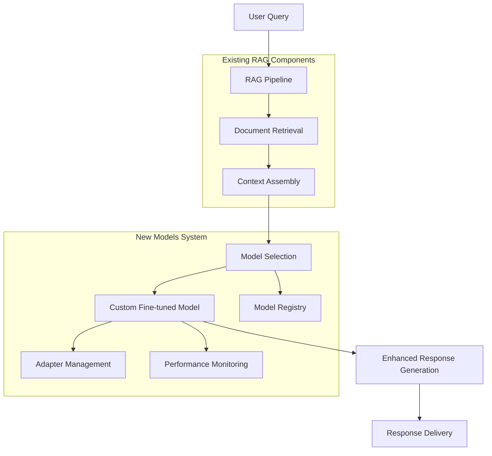

# Models System Integration with LlamaFarm RAG

## 🎯 Overview

This document provides comprehensive integration guidance for connecting the Models system with the existing LlamaFarm RAG framework. The integration is designed to enhance the RAG pipeline with custom fine-tuned models while maintaining backward compatibility and the project's core principles.

## 🏗️ Integration Architecture

### **RAG + Models System Flow**



## 🔗 Integration Points

### **1. Enhanced Pipeline Configuration**

The Models system extends the existing RAG configuration seamlessly:

```json
{
  "name": "Enhanced RAG with Custom Models",
  "version": "2.0.0",
  
  // Existing RAG configuration (unchanged)
  "parser": {
    "type": "PDFParser",
    "config": {"extract_metadata": true}
  },
  "embedder": {
    "type": "OllamaEmbedder", 
    "config": {"model": "nomic-embed-text"}
  },
  "vector_store": {
    "type": "ChromaStore",
    "config": {"collection_name": "documents"}
  },
  "retrieval": {
    "strategy": "hybrid_universal",
    "config": {"top_k": 5}
  },
  
  // New Models system integration
  "models": {
    "enabled": true,
    "model_selection_strategy": "context_aware",
    "config": {
      "primary_model": {
        "model_id": "rag_enhancement_v1.2.0",
        "adapter_id": "domain_specialist_v2.0.0",
        "fallback_model": "base_llama2_7b"
      },
      "hot_swapping": {
        "enabled": true,
        "swap_triggers": ["domain_change", "performance_degradation"],
        "validation_required": true
      },
      "performance_monitoring": {
        "track_latency": true,
        "track_quality": true,
        "alert_thresholds": {
          "latency_p95_ms": 500,
          "quality_score": 0.8
        }
      }
    }
  },
  
  // Enhanced prompts integration
  "prompts": {
    "enabled": true,
    "strategy": "model_optimized",
    "config": {
      "adapt_to_model": true,
      "model_specific_templates": {
        "rag_enhancement_v1.2.0": "rag_optimized_template",
        "medical_specialist_v2.0.0": "medical_qa_template"
      }
    }
  }
}
```

### **2. RAG Pipeline Enhancement**

#### **Enhanced Pipeline Class**
```python
# rag/core/enhanced_pipeline.py (extension)
class Pipeline:
    def __init__(self, config):
        # Existing components initialization
        self.parser = self._create_parser(config)
        self.embedder = self._create_embedder(config)
        self.vector_store = self._create_vector_store(config)
        self.retrieval_strategy = self._create_retrieval_strategy(config)
        
        # Enhanced with Models system
        self.models_enabled = config.get("models", {}).get("enabled", False)
        if self.models_enabled:
            self.model_manager = self._create_model_manager(config["models"])
            self.model_selector = self._create_model_selector(config["models"])
    
    def search(self, query: str, **kwargs) -> EnhancedSearchResult:
        # Step 1: Existing retrieval logic (unchanged)
        documents = self.retrieval_strategy.retrieve(query, **kwargs)
        
        # Step 2: Enhanced with intelligent model selection
        if self.models_enabled:
            # Analyze query and context for optimal model selection
            context_analysis = self._analyze_context(query, documents, kwargs)
            
            # Select optimal model/adapter combination
            selected_model = self.model_selector.select_model(context_analysis)
            
            # Load model if not already active
            active_model = self.model_manager.ensure_model_loaded(selected_model)
            
            # Enhanced generation with custom model
            response = self._generate_enhanced_response(
                query, documents, active_model, context_analysis
            )
            
            return EnhancedSearchResult(
                documents=documents,
                response=response,
                model_used=selected_model,
                context_analysis=context_analysis,
                performance_metrics=self._collect_performance_metrics()
            )
        else:
            # Traditional response generation
            return SearchResult(documents=documents)
    
    def _analyze_context(self, query, documents, kwargs):
        """Analyze context for intelligent model selection"""
        return ContextAnalysis(
            query_complexity=self._assess_query_complexity(query),
            domain_detected=self._detect_domain(query, documents),
            document_types=[doc.metadata.get("type") for doc in documents],
            user_context=kwargs.get("user_context", {}),
            retrieval_quality=self._assess_retrieval_quality(documents),
            performance_requirements=kwargs.get("performance_requirements", {})
        )
```

### **3. Model Selection Strategies**

#### **Context-Aware Model Selection**
```python
class ContextAwareModelSelector:
    """Intelligent model selection based on context analysis"""
    
    def __init__(self, config):
        self.config = config
        self.model_registry = ModelRegistry()
        self.performance_tracker = PerformanceTracker()
    
    def select_model(self, context_analysis: ContextAnalysis) -> ModelSelection:
        """Select optimal model based on context"""
        
        # Domain-based selection
        if context_analysis.domain_detected:
            domain_models = self.model_registry.get_models_by_domain(
                context_analysis.domain_detected
            )
            if domain_models:
                return self._select_best_domain_model(domain_models, context_analysis)
        
        # Performance-based selection
        if context_analysis.performance_requirements:
            return self._select_performance_optimized_model(context_analysis)
        
        # Quality-based selection
        if context_analysis.query_complexity == "high":
            return self._select_high_quality_model(context_analysis)
        
        # Default to primary model
        return ModelSelection(
            model_id=self.config["primary_model"]["model_id"],
            adapter_id=self.config["primary_model"].get("adapter_id"),
            selection_reason="default_primary"
        )
    
    def _select_best_domain_model(self, domain_models, context_analysis):
        """Select best model for specific domain"""
        # Score models based on domain performance and context fit
        model_scores = []
        
        for model in domain_models:
            score = self._calculate_model_score(model, context_analysis)
            model_scores.append((model, score))
        
        # Select highest scoring model
        best_model, best_score = max(model_scores, key=lambda x: x[1])
        
        return ModelSelection(
            model_id=best_model.id,
            adapter_id=best_model.recommended_adapter,
            selection_reason=f"best_domain_model_score_{best_score:.3f}",
            confidence=best_score
        )
```

### **4. Model Manager Integration**

#### **Hot-Swappable Model Management**
```python
class ModelManager:
    """Manage model loading, caching, and hot-swapping"""
    
    def __init__(self, config):
        self.config = config
        self.loaded_models = {}
        self.model_cache = LRUCache(maxsize=3)  # Cache up to 3 models
        self.performance_monitor = PerformanceMonitor()
    
    def ensure_model_loaded(self, model_selection: ModelSelection):
        """Ensure selected model is loaded and ready"""
        model_key = f"{model_selection.model_id}:{model_selection.adapter_id}"
        
        if model_key in self.loaded_models:
            return self.loaded_models[model_key]
        
        # Load model if not in memory
        model = self._load_model(model_selection)
        
        # Cache model for future use
        self.model_cache[model_key] = model
        self.loaded_models[model_key] = model
        
        return model
    
    def hot_swap_adapter(self, current_model, new_adapter_id):
        """Perform hot adapter swap without model reload"""
        if not self.config.get("hot_swapping", {}).get("enabled", False):
            raise ValueError("Hot swapping not enabled")
        
        # Validate compatibility
        if self.config["hot_swapping"]["validation_required"]:
            self._validate_adapter_compatibility(current_model, new_adapter_id)
        
        # Perform swap
        swap_start_time = time.time()
        current_model.swap_adapter(new_adapter_id)
        swap_time = time.time() - swap_start_time
        
        # Log performance metrics
        self.performance_monitor.log_adapter_swap(
            current_model.id, new_adapter_id, swap_time
        )
        
        return current_model
```

### **5. Dataset Creation from RAG Documents**

#### **RAG-to-Training-Data Pipeline**
```python
class RAGDatasetCreator:
    """Create training datasets from existing RAG document corpus"""
    
    def __init__(self, rag_config, dataset_config):
        self.rag_config = rag_config
        self.dataset_config = dataset_config
        self.vector_store = self._load_vector_store()
        self.qa_generator = QAGenerator(dataset_config["generation_model"])
    
    def create_training_dataset(self):
        """Create training dataset from RAG documents"""
        
        # Step 1: Extract documents from RAG system
        documents = self._extract_rag_documents()
        
        # Step 2: Filter and preprocess documents
        filtered_docs = self._filter_documents(documents)
        
        # Step 3: Generate Q&A pairs
        qa_pairs = []
        for doc in filtered_docs:
            doc_qa_pairs = self._generate_qa_pairs(doc)
            qa_pairs.extend(doc_qa_pairs)
        
        # Step 4: Format for training
        training_data = self._format_for_training(qa_pairs)
        
        # Step 5: Quality control
        validated_data = self._validate_dataset_quality(training_data)
        
        return validated_data
    
    def _generate_qa_pairs(self, document):
        """Generate Q&A pairs from document"""
        # Use document content and metadata to generate questions
        content = document.content
        metadata = document.metadata
        
        # Generate different types of questions
        questions = []
        
        # Factual questions
        factual_qs = self.qa_generator.generate_factual_questions(
            content, count=self.dataset_config["questions_per_document"]
        )
        questions.extend(factual_qs)
        
        # Domain-specific questions if metadata indicates domain
        if metadata.get("domain"):
            domain_qs = self.qa_generator.generate_domain_questions(
                content, metadata["domain"], count=2
            )
            questions.extend(domain_qs)
        
        return questions
```

### **6. CLI Integration Enhancement**

#### **Extended CLI Commands**
```bash
# Enhanced RAG commands with models integration
llamafarm search \
  --query "What is machine learning?" \
  --model rag_enhancement_v1.2.0 \
  --adapter domain_specialist \
  --config ./configs/enhanced_rag.json

# Model management within RAG context
llamafarm models train-for-rag \
  --rag-config ./rag/rag_config.json \
  --method lora \
  --output ./trained_models/rag_enhancement_v2

# Create training dataset from RAG documents
llamafarm models create-rag-dataset \
  --rag-config ./rag/rag_config.json \
  --output ./datasets/rag_qa_dataset.json \
  --questions-per-doc 3 \
  --generation-model gpt-4o-mini-turbo

# Deploy enhanced RAG pipeline
llamafarm deploy \
  --config ./configs/enhanced_rag_production.json \
  --environment production \
  --enable-models \
  --enable-hot-swapping

# Monitor RAG+Models performance
llamafarm monitor \
  --pipeline enhanced_rag \
  --metrics latency,quality,model_swaps \
  --dashboard-port 8080
```

#### **Model-Specific RAG Operations**
```bash
# Evaluate model performance within RAG pipeline
llamafarm models evaluate-in-rag \
  --model ./trained_models/my_rag_model \
  --rag-config ./rag/rag_config.json \
  --test-queries ./test_queries.json \
  --metrics rag_accuracy,context_utilization,citation_accuracy

# Compare models within RAG context
llamafarm models compare-rag \
  --models baseline:base_model,enhanced:./trained_models/rag_enhanced \
  --rag-config ./rag/rag_config.json \
  --test-queries ./test_queries.json

# Hot-swap models in running RAG system
llamafarm models hot-swap \
  --from rag_enhancement_v1.1.0 \
  --to rag_enhancement_v1.2.0 \
  --pipeline production_rag \
  --validate-compatibility
```

### **7. Performance Monitoring Integration**

#### **Enhanced Monitoring System**
```python
class EnhancedRAGMonitor:
    """Monitor RAG pipeline performance with Models system"""
    
    def __init__(self, config):
        self.config = config
        self.rag_metrics = RAGMetrics()
        self.model_metrics = ModelMetrics()
        self.integration_metrics = IntegrationMetrics()
    
    def track_enhanced_query(self, query, result):
        """Track query with model information"""
        
        # Traditional RAG metrics
        self.rag_metrics.track_query(query, result)
        
        # Model-specific metrics
        if hasattr(result, 'model_used'):
            self.model_metrics.track_model_usage(
                result.model_used,
                result.response_quality,
                result.generation_time
            )
        
        # Integration-specific metrics
        self.integration_metrics.track_integration_performance(
            retrieval_time=result.retrieval_time,
            model_selection_time=result.model_selection_time,
            generation_time=result.generation_time,
            total_time=result.total_time,
            quality_improvement=self._calculate_quality_improvement(result)
        )
    
    def generate_enhanced_dashboard(self):
        """Generate comprehensive monitoring dashboard"""
        return {
            "rag_performance": self.rag_metrics.get_dashboard_data(),
            "model_performance": self.model_metrics.get_dashboard_data(),
            "integration_metrics": self.integration_metrics.get_dashboard_data(),
            "recommendations": self._generate_recommendations()
        }
```

### **8. Configuration Migration and Validation**

#### **Configuration Upgrade Path**
```python
class ConfigurationMigrator:
    """Migrate existing RAG configs to support Models system"""
    
    def migrate_config(self, old_config_path, new_config_path):
        """Migrate configuration to support Models system"""
        
        # Load existing configuration
        old_config = self.load_config(old_config_path)
        
        # Create new configuration with Models support
        new_config = self._create_enhanced_config(old_config)
        
        # Validate new configuration
        self._validate_enhanced_config(new_config)
        
        # Save migrated configuration
        self.save_config(new_config, new_config_path)
        
        return new_config
    
    def _create_enhanced_config(self, old_config):
        """Create enhanced configuration with Models support"""
        enhanced_config = old_config.copy()
        
        # Add Models system configuration
        enhanced_config["models"] = {
            "enabled": False,  # Default to disabled for backward compatibility
            "model_selection_strategy": "static",
            "config": {
                "primary_model": {
                    "model_id": "base_model",
                    "fallback_model": "base_model"
                },
                "hot_swapping": {"enabled": False},
                "performance_monitoring": {"track_latency": True}
            }
        }
        
        # Enhance existing prompts configuration if present
        if "prompts" in enhanced_config:
            enhanced_config["prompts"]["config"]["adapt_to_model"] = False
        
        return enhanced_config
```

### **9. Testing Integration**

#### **Integration Test Suite**
```python
class RAGModelsIntegrationTests:
    """Test suite for RAG + Models system integration"""
    
    def test_end_to_end_enhanced_rag(self):
        """Test complete enhanced RAG pipeline"""
        config = self.load_test_config("enhanced_rag_test.json")
        pipeline = Pipeline.from_config(config)
        
        # Test query processing
        result = pipeline.search("What is machine learning?")
        
        # Verify enhanced result structure
        assert hasattr(result, 'model_used')
        assert hasattr(result, 'context_analysis')
        assert hasattr(result, 'performance_metrics')
        
        # Verify response quality
        assert result.response is not None
        assert len(result.response) > 0
    
    def test_model_hot_swapping(self):
        """Test hot model swapping during operation"""
        pipeline = self.setup_test_pipeline()
        
        # Initial query with model A
        result1 = pipeline.search("Test query", model_preference="model_a")
        assert result1.model_used == "model_a"
        
        # Hot swap to model B
        pipeline.model_manager.hot_swap_model("model_a", "model_b")
        
        # Subsequent query should use model B
        result2 = pipeline.search("Test query")
        assert result2.model_used == "model_b"
    
    def test_performance_degradation_handling(self):
        """Test handling of performance degradation"""
        pipeline = self.setup_test_pipeline()
        
        # Simulate performance degradation
        self.simulate_high_latency("primary_model")
        
        # Verify fallback to backup model
        result = pipeline.search("Test query")
        assert result.model_used != "primary_model"
        assert result.selection_reason == "performance_fallback"
```

### **10. Deployment Integration**

#### **Docker Configuration Enhancement**
```dockerfile
# Enhanced Dockerfile supporting Models system
FROM llamafarm-base:latest

# Install Models system dependencies
COPY models/ /app/models/
RUN pip install -r models/requirements.txt

# Install model management tools
RUN pip install transformers peft accelerate

# Configure model storage
ENV MODELS_STORAGE_PATH=/app/model_storage
ENV MODEL_CACHE_SIZE=3
ENV HOT_SWAPPING_ENABLED=true

# Enhanced configuration
COPY configs/enhanced_rag_production.json /app/config/rag_config.json

# Model registry configuration
ENV MODEL_REGISTRY_URL=http://registry.llamafarm.internal
ENV MODEL_REGISTRY_TOKEN=${MODEL_REGISTRY_TOKEN}

# Start enhanced RAG service
CMD ["python", "-m", "rag.server", "--config", "/app/config/rag_config.json", "--enable-models"]
```

#### **Kubernetes Deployment Enhancement**
```yaml
apiVersion: apps/v1
kind: Deployment
metadata:
  name: llamafarm-enhanced-rag
spec:
  replicas: 3
  selector:
    matchLabels:
      app: llamafarm-enhanced-rag
  template:
    spec:
      containers:
      - name: enhanced-rag
        image: llamafarm/enhanced-rag:latest
        env:
        - name: MODELS_ENABLED
          value: "true"
        - name: MODEL_REGISTRY_URL
          value: "http://model-registry.llamafarm.svc.cluster.local"
        - name: HOT_SWAPPING_ENABLED
          value: "true"
        resources:
          requests:
            nvidia.com/gpu: 1
            memory: "32Gi"
            cpu: "4"
          limits:
            nvidia.com/gpu: 1
            memory: "64Gi"
            cpu: "8"
        volumeMounts:
        - name: model-cache
          mountPath: /app/model_storage
      volumes:
      - name: model-cache
        emptyDir:
          sizeLimit: "100Gi"
---
apiVersion: v1
kind: Service
metadata:
  name: enhanced-rag-service
spec:
  selector:
    app: llamafarm-enhanced-rag
  ports:
  - name: http
    port: 80
    targetPort: 8000
  - name: grpc
    port: 9000
    targetPort: 9000
```

## 🚀 Migration Timeline

### **Phase 1: Foundation (Weeks 1-2)**
- [ ] **Enhanced Configuration Schema**: Add Models system support to RAG configs
- [ ] **Basic Model Manager**: Simple model loading and caching
- [ ] **CLI Integration**: Basic commands for enhanced RAG
- [ ] **Backward Compatibility**: Ensure existing RAG systems continue working

### **Phase 2: Core Integration (Weeks 3-4)**
- [ ] **Model Selection Strategies**: Implement context-aware model selection
- [ ] **Hot-Swapping**: Runtime model switching capability
- [ ] **Dataset Creation**: RAG-to-training-data pipeline
- [ ] **Performance Monitoring**: Enhanced monitoring with model metrics

### **Phase 3: Advanced Features (Weeks 5-6)**
- [ ] **Multi-Model Support**: Support for model ensembles and voting
- [ ] **Advanced Caching**: Intelligent model caching strategies
- [ ] **Quality Gates**: Automated quality validation for model swaps
- [ ] **Production Deployment**: Production-ready configurations

### **Phase 4: Optimization (Weeks 7-8)**
- [ ] **Performance Optimization**: Latency and throughput optimization
- [ ] **Advanced Monitoring**: Comprehensive dashboards and alerting
- [ ] **Auto-Scaling**: Dynamic resource allocation based on model usage
- [ ] **Enterprise Features**: Multi-tenant support and advanced security

## 📊 Success Metrics

### **Performance Targets**
- **Response Quality**: >15% improvement over baseline RAG
- **System Latency**: <20% increase with Models system enabled
- **Model Swap Time**: <200ms for adapter swaps, <2s for full model swaps
- **System Reliability**: >99.9% uptime with hot-swapping enabled

### **Integration Quality**
- **Backward Compatibility**: 100% of existing RAG configurations work unchanged
- **Configuration Migration**: Automatic migration with zero manual intervention
- **API Compatibility**: All existing API endpoints continue working
- **Performance Monitoring**: Real-time visibility into all system components

The Models system integration enhances the LlamaFarm RAG framework with sophisticated model management capabilities while maintaining the project's core values of simplicity, configurability, and production readiness.

<function_calls>
<invoke name="TodoWrite">
<parameter name="todos">[{"id": "1", "content": "Create models directory structure", "status": "completed", "priority": "high"}, {"id": "2", "content": "Write main models README with strategy and roadmap", "status": "completed", "priority": "high"}, {"id": "3", "content": "Create subdirectory READMEs for fine-tuning methods", "status": "completed", "priority": "high"}, {"id": "4", "content": "Document dataset creation and management", "status": "completed", "priority": "medium"}, {"id": "5", "content": "Define integration with existing RAG system", "status": "completed", "priority": "medium"}]