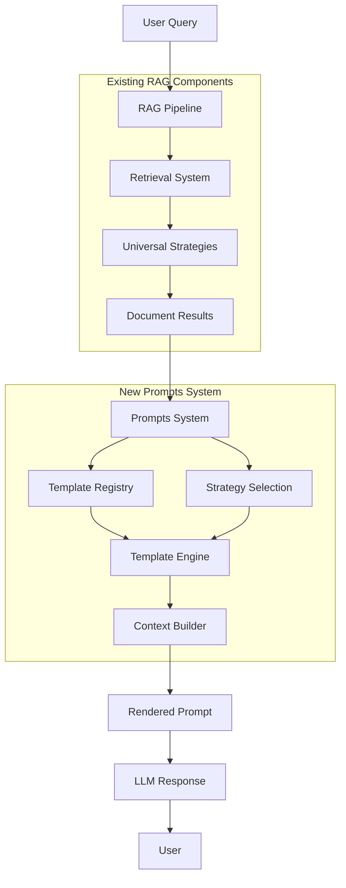

# LlamaFarm Prompts System Integration Guide

## 🎯 Overview

This document provides a comprehensive guide for integrating the prompts system with the existing LlamaFarm RAG framework. The integration is designed to be seamless, maintaining backward compatibility while adding powerful prompt management capabilities.

## 🏗️ Integration Architecture

### **System Integration Points**



## 🔌 Integration Points

### **1. Configuration System Integration**

#### **Extended Configuration Schema**
The prompts system extends the existing RAG configuration without breaking changes:

```json
{
  "name": "Enhanced RAG Pipeline with Prompts",
  "version": "2.0",
  
  // Existing RAG configuration (unchanged)
  "parser": {
    "type": "PDFParser",
    "config": { "extract_metadata": true }
  },
  "embedder": {
    "type": "OllamaEmbedder",
    "config": { "model": "nomic-embed-text" }
  },
  "vector_store": {
    "type": "ChromaStore",
    "config": { "collection_name": "documents" }
  },
  "retrieval": {
    "strategy": "hybrid_universal",
    "config": { "top_k": 5 }
  },
  
  // New prompts configuration
  "prompts": {
    "enabled": true,
    "strategy": "context_aware",
    "config": {
      "adapt_to_retrieval": true,
      "use_document_metadata": true,
      "fallback_chain": ["domain_specific", "rule_based", "basic"]
    },
    
    "templates": {
      "qa_basic": {
        "template": "Context: {context}\\n\\nQuestion: {question}\\n\\nAnswer:",
        "input_variables": ["context", "question"]
      }
    }
  }
}
```

#### **Backward Compatibility**
```python
# Existing code continues to work unchanged
pipeline = Pipeline.from_config("existing_config.json")
results = pipeline.run("query")

# New prompts functionality is optional
if config.get("prompts", {}).get("enabled", False):
    # Enhanced prompts processing
    pass
else:
    # Traditional processing
    pass
```

### **2. Enhanced Pipeline Integration**

#### **Modified Pipeline Class**
```python
# rag/core/enhanced_pipeline.py (existing file)
class Pipeline:
    def __init__(self, config):
        # Existing components
        self.parser = self._create_parser(config)
        self.embedder = self._create_embedder(config)
        self.vector_store = self._create_vector_store(config)
        self.retrieval_strategy = self._create_retrieval_strategy(config)
        
        # New prompts system (optional)
        self.prompts_enabled = config.get("prompts", {}).get("enabled", False)
        if self.prompts_enabled:
            self.prompt_system = self._create_prompt_system(config["prompts"])
    
    def search(self, query: str, **kwargs) -> SearchResult:
        # Existing retrieval logic (unchanged)
        documents = self.retrieval_strategy.retrieve(query, **kwargs)
        
        # Enhanced with prompts (if enabled)
        if self.prompts_enabled:
            # Build context for prompt selection
            context = self._build_prompt_context(query, documents, kwargs)
            
            # Select optimal template
            template_id = self.prompt_system.select_template(context)
            
            # Render prompt with context
            rendered_prompt = self.prompt_system.render_template(
                template_id, 
                {"context": self._format_documents(documents), "question": query}
            )
            
            # Return enhanced result
            return SearchResult(
                documents=documents,
                rendered_prompt=rendered_prompt,
                template_used=template_id,
                prompt_context=context
            )
        else:
            # Traditional result (unchanged)
            return SearchResult(documents=documents)
```

### **3. Retrieval Strategy Integration**

#### **Context-Aware Prompt Selection**
The prompts system leverages retrieval metadata for intelligent template selection:

```python
# Integration with universal retrieval strategies
class RetrievalPromptIntegration:
    def build_prompt_context(self, query: str, retrieval_result: RetrievalResult) -> PromptContext:
        return PromptContext(
            query={
                "text": query,
                "complexity": self._analyze_query_complexity(query),
                "intent": self._detect_query_intent(query)
            },
            documents={
                "count": len(retrieval_result.documents),
                "types": [doc.metadata.get("type") for doc in retrieval_result.documents],
                "domains": [doc.metadata.get("domain") for doc in retrieval_result.documents],
                "avg_relevance": retrieval_result.avg_relevance_score,
                "retrieval_strategy": retrieval_result.strategy_used
            },
            system={
                "retrieval_quality": self._assess_retrieval_quality(retrieval_result),
                "processing_time": retrieval_result.processing_time
            }
        )
```

#### **Retrieval Strategy Metadata Enhancement**
```python
# Extend existing retrieval results with prompt-relevant metadata
class EnhancedRetrievalResult:
    def __init__(self, documents, strategy_used, processing_time):
        self.documents = documents
        self.strategy_used = strategy_used
        self.processing_time = processing_time
        
        # New prompt-relevant metadata
        self.document_types = self._extract_document_types()
        self.domain_distribution = self._analyze_domain_distribution()
        self.avg_relevance_score = self._calculate_avg_relevance()
        self.quality_assessment = self._assess_quality()
    
    def to_prompt_metadata(self) -> Dict:
        """Convert to prompt context metadata"""
        return {
            "retrieval_strategy": self.strategy_used,
            "document_count": len(self.documents),
            "avg_relevance": self.avg_relevance_score,
            "quality_score": self.quality_assessment,
            "domains": self.domain_distribution,
            "types": self.document_types
        }
```

### **4. CLI Integration**

#### **Extended CLI Commands**
```python
# cli/cmd/ (Go CLI integration)
// New prompt management commands
func init() {
    rootCmd.AddCommand(promptsCmd)
    
    promptsCmd.AddCommand(promptsListCmd)
    promptsCmd.AddCommand(promptsTestCmd)
    promptsCmd.AddCommand(promptsValidateCmd)
}

var promptsCmd = &cobra.Command{
    Use:   "prompts",
    Short: "Manage prompt templates and strategies",
    Long:  "Commands for managing the LlamaFarm prompts system",
}
```

```python
# rag/cli.py (Python CLI extension)
@click.group()
def prompts():
    """Prompt system management commands"""
    pass

@prompts.command()
@click.option('--domain', help='Filter by domain')
@click.option('--complexity', help='Filter by complexity')
def list_templates(domain, complexity):
    """List available prompt templates"""
    # Implementation

@prompts.command()
@click.argument('config_path')
def test_prompts(config_path):
    """Test prompts configuration"""
    pipeline = Pipeline.from_config(config_path)
    if not pipeline.prompts_enabled:
        click.echo("Prompts not enabled in configuration")
        return
    
    # Run prompt system tests
    test_results = pipeline.prompt_system.run_tests()
    for result in test_results:
        click.echo(f"Template {result.template_id}: {'PASS' if result.success else 'FAIL'}")

# Add to main CLI
cli.add_command(prompts)
```

### **5. API Integration**

#### **Enhanced Search API**
```python
# rag/api.py (existing file extension)
class SearchAPI:
    def __init__(self, config_path: str):
        self.pipeline = Pipeline.from_config(config_path)
    
    def search(self, query: str, options: Dict = None) -> Dict:
        """Enhanced search with prompts support"""
        options = options or {}
        
        # Execute search with existing pipeline
        result = self.pipeline.search(query, **options)
        
        # Prepare response
        response = {
            "query": query,
            "documents": [doc.to_dict() for doc in result.documents],
            "metadata":{
                "total_results": len(result.documents),
                "processing_time": result.processing_time
            }
        }
        
        # Add prompts information if enabled
        if hasattr(result, 'rendered_prompt'):
            response["prompts"] = {
                "template_used": result.template_used,
                "rendered_prompt": result.rendered_prompt,
                "selection_context": result.prompt_context.to_dict()
            }
        
        return response
    
    def get_prompt_templates(self) -> Dict:
        """New API endpoint for prompt templates"""
        if not self.pipeline.prompts_enabled:
            return {"error": "Prompts system not enabled"}
        
        templates = self.pipeline.prompt_system.list_templates()
        return {
            "templates": [template.to_dict() for template in templates],
            "count": len(templates)
        }
```

### **6. Vector Store Integration**

#### **Metadata Enhancement for Prompt Selection**
```python
# rag/stores/chroma_store.py (existing file extension)
class ChromaStore:
    def search(self, query_vector, top_k=5, filters=None):
        # Existing search implementation
        results = self._execute_search(query_vector, top_k, filters)
        
        # Enhance results with prompt-relevant metadata
        enhanced_results = []
        for result in results:
            # Extract metadata useful for prompt selection
            prompt_metadata = {
                "document_type": result.metadata.get("type", "unknown"),
                "domain": result.metadata.get("domain", "general"),
                "complexity": self._assess_document_complexity(result.content),
                "length": len(result.content),
                "relevance_score": result.score
            }
            
            result.prompt_metadata = prompt_metadata
            enhanced_results.append(result)
        
        return enhanced_results
```

### **7. Factory Pattern Integration**

#### **Extended Component Factory**
```python
# rag/core/factories.py (existing file extension)
class ComponentFactory:
    @staticmethod
    def create_prompt_system(config: Dict) -> PromptSystem:
        """Create prompt system from configuration"""
        strategy_type = config.get("strategy", "basic")
        strategy_config = config.get("config", {})
        
        # Create strategy using existing factory pattern
        strategy = StrategyFactory.create_strategy(strategy_type, strategy_config)
        
        # Create template registry
        template_registry = TemplateRegistry()
        
        # Load templates from configuration
        templates = config.get("templates", {})
        for template_id, template_config in templates.items():
            template = TemplateFactory.create_template(template_id, template_config)
            template_registry.register_template(template)
        
        return PromptSystem(strategy, template_registry)
    
    @staticmethod
    def create_enhanced_pipeline(config: Dict) -> Pipeline:
        """Create pipeline with optional prompts integration"""
        # Create base pipeline (existing logic)
        pipeline = Pipeline(config)
        
        # Add prompts system if enabled
        if config.get("prompts", {}).get("enabled", False):
            prompt_system = ComponentFactory.create_prompt_system(config["prompts"])
            pipeline.add_prompt_system(prompt_system)
        
        return pipeline
```

## 🔄 Migration Strategy

### **Phase 1: Non-Breaking Integration**
1. **Add prompts as optional feature** - Existing configs work unchanged
2. **Extend existing classes** - Add prompts functionality without breaking existing methods
3. **Backward compatibility** - Ensure all existing functionality continues to work

### **Phase 2: Enhanced Features**
1. **Enable prompts in example configurations** - Show benefits of new system
2. **Add CLI commands** - Provide tools for prompt management
3. **Extend API** - Add new endpoints for prompt functionality

### **Phase 3: Optimization**
1. **Integrate with monitoring** - Add prompts metrics to existing monitoring
2. **Performance optimization** - Optimize prompt selection for speed
3. **Advanced features** - A/B testing, ML-driven selection

## 📊 Configuration Migration Examples

### **Basic Migration**
```json
// Before (existing config)
{
  "name": "Basic RAG Pipeline",
  "retrieval": {
    "strategy": "basic_similarity",
    "config": {"top_k": 5}
  }
}

// After (with prompts)
{
  "name": "Enhanced RAG Pipeline", 
  "retrieval": {
    "strategy": "basic_similarity",
    "config": {"top_k": 5}
  },
  "prompts": {
    "enabled": true,
    "strategy": "static_selection",
    "config": {
      "default_template": "qa_basic"
    },
    "templates": {
      "qa_basic": {
        "template": "Based on: {context}\\n\\nQ: {question}\\nA:",
        "input_variables": ["context", "question"]
      }
    }
  }
}
```

### **Advanced Migration**
```json
// Existing domain-specific config enhanced with prompts
{
  "name": "Medical RAG with Intelligent Prompts",
  "parser": {
    "type": "MedicalPDFParser",
    "config": {"extract_medical_entities": true}
  },
  "retrieval": {
    "strategy": "metadata_filtered",
    "config": {
      "filters": {"domain": "medical"},
      "top_k": 10
    }
  },
  "prompts": {
    "enabled": true,
    "strategy": "domain_specific",
    "domain": "medical",
    "config": {
      "compliance_mode": "HIPAA",
      "selection_rules": [
        {
          "condition": "document_metadata.type == 'clinical_note'",
          "template": "clinical_analysis"
        },
        {
          "condition": "user_role == 'physician'",
          "template": "physician_detailed"
        }
      ]
    }
  }
}
```

## 🧪 Testing Integration

### **Integration Test Example**
```python
# tests/integration/test_prompts_rag_integration.py
class TestPromptsRAGIntegration:
    def test_end_to_end_with_prompts(self):
        """Test complete RAG pipeline with prompts"""
        config = {
            "vector_store": {"type": "ChromaStore"},
            "retrieval": {"strategy": "basic_similarity"},
            "prompts": {
                "enabled": True,
                "strategy": "rule_based",
                "templates": {
                    "qa_test": {
                        "template": "Context: {context}\\nQ: {question}\\nA:",
                        "input_variables": ["context", "question"]
                    }
                }
            }
        }
        
        pipeline = Pipeline.from_config(config)
        result = pipeline.search("What is machine learning?")
        
        # Verify prompts integration
        assert hasattr(result, 'rendered_prompt')
        assert result.template_used == "qa_test"
        assert "Context:" in result.rendered_prompt
        assert "What is machine learning?" in result.rendered_prompt
```

## 📈 Performance Considerations

### **Performance Impact Assessment**
- **Template Selection**: <10ms overhead per query
- **Template Rendering**: <5ms for typical templates
- **Context Building**: <5ms using existing document metadata
- **Total Overhead**: <20ms per query (acceptable for most use cases)

### **Optimization Strategies**
1. **Template Caching**: Compile templates once, reuse multiple times
2. **Context Caching**: Cache context objects for similar queries
3. **Lazy Loading**: Load templates only when needed
4. **Batch Processing**: Process multiple templates together when possible

## 🔒 Security Integration

### **Security Considerations**
1. **Input Validation**: Extend existing validation to cover prompt inputs
2. **Template Sanitization**: Validate templates to prevent injection attacks
3. **Output Filtering**: Apply existing output filters to rendered prompts
4. **Access Control**: Use existing permission system for prompt management

## 📊 Monitoring Integration

### **Extended Metrics**
```python
# Extend existing metrics collection
class EnhancedMetrics:
    def __init__(self):
        self.existing_metrics = RAGMetrics()  # Existing metrics
        self.prompt_metrics = PromptMetrics()  # New metrics
    
    def track_query(self, query, result):
        # Existing tracking
        self.existing_metrics.track_query(query, result)
        
        # New prompt tracking
        if hasattr(result, 'template_used'):
            self.prompt_metrics.track_template_usage(
                result.template_used,
                result.template_selection_time,
                result.prompt_context
            )
```

## 🚀 Deployment Integration

### **Docker Integration**
```dockerfile
# Extend existing Dockerfile
FROM llamafarm-base:latest

# Add prompts system dependencies
COPY prompts/ /app/prompts/
RUN pip install -r prompts/requirements.txt

# Configuration with prompts enabled
ENV PROMPTS_ENABLED=true
ENV PROMPTS_CONFIG_PATH=/app/config/prompts_config.json
```

### **Kubernetes Integration**
```yaml
# Extend existing K8s deployment
apiVersion: apps/v1
kind: Deployment
metadata:
  name: llamafarm-with-prompts
spec:
  template:
    spec:
      containers:
      - name: llamafarm
        image: llamafarm:prompts-enabled
        env:
        - name: PROMPTS_ENABLED
          value: "true"
        - name: PROMPTS_STRATEGY
          value: "context_aware"
```

## 🔄 Next Steps

### **Implementation Phases**
1. **Phase 1 (Weeks 1-2)**: Basic integration, template engine, simple strategies
2. **Phase 2 (Weeks 3-4)**: Advanced strategies, registry system, CLI integration
3. **Phase 3 (Weeks 5-6)**: Performance optimization, comprehensive testing
4. **Phase 4 (Weeks 7-8)**: Production deployment, monitoring integration

### **Success Metrics**
- **Functionality**: All existing RAG functionality continues to work
- **Performance**: <20ms overhead per query with prompts enabled
- **Usability**: Intuitive configuration and management
- **Reliability**: >99.9% uptime with prompts system active

<function_calls>
<invoke name="TodoWrite">
<parameter name="todos">[{"id": "1", "content": "Create prompts directory structure", "status": "completed", "priority": "high"}, {"id": "2", "content": "Write main prompts README with strategy and vision", "status": "completed", "priority": "high"}, {"id": "3", "content": "Create subdirectory READMEs for component organization", "status": "completed", "priority": "medium"}, {"id": "4", "content": "Document integration points with existing RAG system", "status": "completed", "priority": "medium"}]