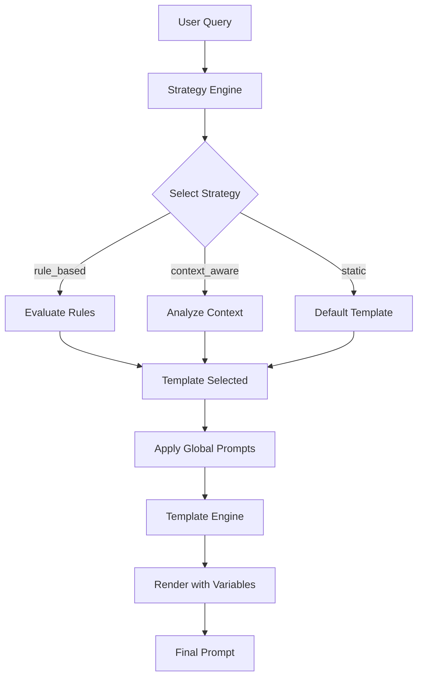

# LlamaFarm Prompts System - Developer Structure Guide

> **For Project Developers**: This document explains the internal architecture, organization, and concepts of the prompts management system. For user documentation, see [README.md](README.md).

## 🏗️ System Architecture Overview

The LlamaFarm Prompts System follows a **layered architecture** with clear separation of concerns:

```
┌─────────────────────────────────────────────────────┐
│                   CLI Interface                     │
├─────────────────────────────────────────────────────┤
│                  Core Engines                       │
│  PromptSystem │ StrategyEngine │ TemplateEngine     │
├─────────────────────────────────────────────────────┤
│                 Data Models                         │
│  PromptTemplate │ PromptStrategy │ PromptConfig     │
├─────────────────────────────────────────────────────┤
│                Template Storage                     │
│        Individual JSON files by category           │
└─────────────────────────────────────────────────────┘
```

## 📁 Directory Structure Detailed

```
prompts/
├── README.md                           # User documentation
├── STRUCTURE.md                        # This file - developer guide
├── pyproject.toml                      # Python package configuration
├── setup_and_demo.sh                  # Complete demo with LLM integration
├── generate_config.py                 # Builds unified config from templates
├── uv.lock                            # Dependency lock file
│
├── prompts/                           # Core system package
│   ├── __init__.py                    # Package initialization
│   ├── cli.py                         # Click-based CLI with 25+ commands
│   │
│   ├── models/                        # Pydantic data models
│   │   ├── __init__.py
│   │   ├── template.py                # PromptTemplate, TemplateType, TemplateMetadata
│   │   ├── strategy.py                # PromptStrategy, SelectionRule, StrategyConfig
│   │   ├── config.py                  # PromptConfig, GlobalPromptConfig
│   │   └── context.py                 # PromptContext, ExecutionContext
│   │
│   ├── core/                          # Core system engines
│   │   ├── __init__.py
│   │   ├── prompt_system.py           # Main orchestration engine
│   │   ├── template_engine.py         # Jinja2 rendering with custom filters
│   │   ├── strategy_engine.py         # Template selection strategies
│   │   ├── template_registry.py       # Template storage and search
│   │   └── global_prompt_manager.py   # Global prompt application
│   │
│   ├── utils/                         # Utility functions
│   │   ├── __init__.py
│   │   ├── template_loader.py         # Load templates from filesystem
│   │   └── config_builder.py          # Build configuration objects
│   │
│   └── integrations/                  # External system integrations
│       ├── __init__.py
│       └── langgraph_integration.py   # LangGraph workflow integration
│
├── templates/                         # Template storage (JSON files)
│   ├── basic/                         # Basic Q&A and text generation
│   │   ├── qa_basic.json             # Simple question answering
│   │   ├── qa_detailed.json          # Detailed question answering
│   │   └── summarization.json        # Text summarization
│   │
│   ├── chat/                          # Conversational templates
│   │   └── assistant_basic.json      # Basic chat assistant
│   │
│   ├── few_shot/                      # Example-based learning
│   │   └── few_shot_classification.json
│   │
│   ├── advanced/                      # Complex reasoning templates
│   │   ├── chain_of_thought.json     # Step-by-step reasoning
│   │   ├── comparative_analysis.json # Side-by-side comparison
│   │   └── ab_testing.json          # A/B test evaluation
│   │
│   ├── domain_specific/               # Specialized domain templates
│   │   ├── medical_qa.json           # Medical domain Q&A
│   │   ├── code_analysis.json        # Code review and analysis
│   │   ├── llm_judge.json           # LLM-as-Judge evaluation
│   │   ├── prompt_evaluation.json    # Prompt quality assessment
│   │   ├── response_scoring.json     # Response quality scoring
│   │   └── rag_evaluation.json       # RAG system evaluation
│   │
│   └── agentic/                       # Multi-agent workflow templates
│       ├── tool_planning.json         # Multi-step tool planning
│       ├── agent_coordinator.json     # Multi-agent coordination
│       ├── tool_execution.json        # Structured tool execution
│       ├── workflow_orchestration.json # Complex workflow management
│       ├── agent_reflection.json      # Agent self-reflection
│       └── tool_selection.json        # Intelligent tool selection
│
├── strategies/                        # Strategy documentation
│   └── README.md                      # Strategy implementation guide
│
├── config/                           # Generated configuration files
│   └── default_prompts.json         # Unified configuration (auto-generated)
│
├── tests/                            # Test suite
│   ├── __init__.py
│   ├── test_prompt_system.py        # Core system tests
│   ├── data/                        # Test data
│   │   ├── sample_contexts.json     # Test contexts
│   │   ├── sample_variables.json    # Test variables
│   │   └── sample_rag_responses.json # Test RAG data
│   └── README.md                    # Testing guidelines
│
├── examples/                         # Usage examples
└── logs/                            # Runtime logs (created at runtime)
```

## 🔧 Core Concepts & Components

### 1. **Templates vs Prompts** - Key Differences

| Aspect | Template | Prompt |
|--------|----------|--------|
| **Definition** | Reusable Jinja2 template with variables | Rendered, final text sent to LLM |
| **Storage** | JSON files in `templates/` directory | Generated dynamically at runtime |
| **Variables** | Contains `{{variable}}` placeholders | Variables resolved to actual values |
| **Reusability** | Highly reusable across contexts | Single-use, context-specific |
| **Structure** | Structured metadata + template string | Plain text optimized for LLM |

**Example:**
```python
# Template (stored in templates/basic/qa_basic.json)
{
  "template": "Question: {{query}}\nContext: {{context}}\nAnswer:",
  "input_variables": ["query", "context"]
}

# Rendered Prompt (sent to LLM)
"Question: What is machine learning?\nContext: ML is a subset of AI...\nAnswer:"
```

### 2. **Template Structure** - JSON Schema

Every template follows this structure:

```json
{
  "template_id": "unique_identifier",
  "name": "Human-readable name",
  "type": "basic|chat|few_shot|advanced|domain_specific|agentic",
  "template": "Jinja2 template string with {{variables}} and ",
  "input_variables": ["required", "variables"],
  "optional_variables": ["optional", "variables", "with", "defaults"],
  "validation_rules": {
    "variable_name": {"type": "str", "min_length": 1}
  },
  "metadata": {
    "use_case": "Primary use case description",
    "domain": "general|medical|technical|agentic",
    "complexity": "low|medium|high",
    "tags": ["searchable", "tags"],
    "description": "Detailed description",
    "examples": [{"variable": "example_value"}]
  }
}
```

### 3. **Template Categories** - Purpose & Use Cases

| Category | Purpose | Template Count | Use Cases |
|----------|---------|----------------|-----------|
| **basic** | Simple Q&A and text generation | 3 | FAQ, basic queries, summarization |
| **chat** | Conversational interfaces | 1 | Chatbots, assistants, dialogue |
| **few_shot** | Example-based learning | 1 | Classification, pattern learning |
| **advanced** | Complex reasoning | 3 | Analysis, comparison, A/B testing |
| **domain_specific** | Specialized domains | 6 | Medical, code, evaluation |
| **agentic** | Multi-agent workflows | 6 | Tool planning, coordination, orchestration |

### 4. **Strategy System** - Template Selection Logic

The system uses **3 intelligent strategies** for automatic template selection:

#### **Static Strategy** (`static_strategy`)
- **Purpose**: Simple, rule-free template selection
- **Logic**: Always returns a predefined default template
- **Use Case**: Testing, simple applications

#### **Rule-Based Strategy** (`rule_based_strategy`)  
- **Purpose**: Explicit conditional template selection
- **Logic**: Evaluates context conditions against defined rules
- **Use Case**: Domain-specific routing (medical queries → medical_qa)

```python
# Rule example
{
  "condition": {"domain": "medical"},
  "template_id": "medical_qa",
  "priority": 100
}
```

#### **Context-Aware Strategy** (`context_aware_strategy`)
- **Purpose**: Intelligent selection based on multiple factors
- **Logic**: Analyzes query intent, domain, complexity, available context
- **Use Case**: Production systems with diverse query types

### 5. **Core Processing Flow**



## 🎯 Component Deep Dive

### **PromptSystem** - Main Orchestrator
- **Location**: `prompts/core/prompt_system.py`
- **Responsibility**: Coordinates template selection, global prompt application, and rendering
- **Key Methods**:
  - `execute_prompt()`: Main entry point for prompt generation
  - `get_template()`: Retrieve templates by ID
  - `list_templates()`: Browse available templates

### **TemplateEngine** - Jinja2 Rendering
- **Location**: `prompts/core/template_engine.py`
- **Responsibility**: Renders Jinja2 templates with custom filters
- **Custom Filters**:
  - `format_documents`: Format document lists for RAG
  - `clean_template`: Clean template formatting
- **Features**: Syntax validation, variable detection, error handling

### **StrategyEngine** - Template Selection
- **Location**: `prompts/core/strategy_engine.py`
- **Responsibility**: Implements template selection strategies
- **Strategies**: Static, rule-based, context-aware
- **Extension**: Easy to add new strategies by implementing `PromptStrategy`

### **TemplateRegistry** - Template Storage
- **Location**: `prompts/core/template_registry.py`
- **Responsibility**: Store, search, and validate templates
- **Features**: 
  - Search by ID, type, domain, tags
  - Validation with custom rules
  - Performance indexing

### **GlobalPromptManager** - System-wide Prompts
- **Location**: `prompts/core/global_prompt_manager.py`
- **Responsibility**: Apply system-wide prompts to all templates
- **Types**:
  - **System prompts**: Applied to system context
  - **Prefix prompts**: Added before template content
  - **Suffix prompts**: Added after template content

## 🔄 Configuration System

### **Generation Process**
1. **Templates**: Individual JSON files in `templates/` directories
2. **Loader**: `template_loader.py` scans directories and loads templates
3. **Builder**: `config_builder.py` combines templates with strategies and global prompts
4. **Output**: Unified `config/default_prompts.json` file

### **Auto-Generation**
```bash
# Regenerate configuration from template files
uv run python generate_config.py
```

### **Configuration Structure**
```json
{
  "name": "Configuration name",
  "templates": {
    "template_id": { /* PromptTemplate object */ }
  },
  "strategies": {
    "strategy_id": { /* PromptStrategy object */ }
  },
  "global_prompts": [
    { /* GlobalPromptConfig objects */ }
  ]
}
```

## 🧪 Testing Architecture

### **Test Organization**
- **Unit Tests**: Individual component testing
- **Integration Tests**: End-to-end workflow testing
- **Template Tests**: Template rendering and validation
- **Strategy Tests**: Strategy selection logic

### **Test Data**
- **`tests/data/sample_contexts.json`**: Various context scenarios
- **`tests/data/sample_variables.json`**: Template variable examples
- **`tests/data/sample_rag_responses.json`**: RAG evaluation data

### **Running Tests**
```bash
# Run all tests
uv run pytest

# Run with coverage
uv run pytest --cov=prompts

# Run specific test categories
uv run pytest tests/test_prompt_system.py
```

## 🔌 Integration Points

### **LangGraph Integration**
- **File**: `prompts/integrations/langgraph_integration.py`
- **Purpose**: Convert prompts to LangGraph workflow nodes
- **Usage**: Enable workflow orchestration with LangGraph

### **RAG System Integration**
- **Templates**: `rag_evaluation.json`, `llm_judge.json`
- **Purpose**: Evaluate RAG system performance
- **Context**: Handles retrieved documents and response evaluation

### **CLI Integration**
- **File**: `prompts/cli.py`
- **Commands**: 25+ commands for template management
- **Features**: Interactive prompts, batch operations, validation

## 🚀 Extension Guidelines

### **Adding New Templates**
1. Create JSON file in appropriate `templates/` subdirectory
2. Follow template JSON schema (see section 2)
3. Add comprehensive metadata and examples
4. Run `uv run python generate_config.py` to regenerate config
5. Test with CLI: `uv run python -m prompts.cli template show <template_id>`

### **Adding New Strategies**
1. Implement `PromptStrategy` interface in `strategy_engine.py`
2. Add strategy configuration to `generate_config.py`
3. Test strategy selection logic
4. Update documentation

### **Adding New Template Categories**
1. Create new directory under `templates/`
2. Update `template_loader.py` to include new category
3. Update `TemplateType` enum in `models/template.py`
4. Add category documentation

### **Custom Jinja2 Filters**
1. Add filter function to `template_engine.py`
2. Register filter in `TemplateEngine.__init__()`
3. Document filter usage and examples
4. Test filter with various inputs

## 📊 Performance Considerations

### **Template Loading**
- Templates loaded once at startup
- Cached in memory for fast access
- Lazy loading for large template sets

### **Strategy Execution**
- Context-aware strategy has O(n) complexity
- Rule-based strategy has O(r) complexity (r = rules)
- Static strategy has O(1) complexity

### **Rendering Performance**
- Jinja2 templates compiled once and cached
- Variable validation cached per template
- Custom filters optimized for common use cases

## 🔍 Debugging & Troubleshooting

### **Common Issues**

**Template Validation Errors**:
- Check variable names match template content
- Verify JSON syntax in template files
- Ensure required variables are provided

**Strategy Selection Issues**:
- Enable verbose logging: `--verbose` flag
- Check context variables match strategy conditions
- Verify strategy priority and rules

**Rendering Errors**:
- Validate Jinja2 syntax with `template validate <id>`
- Check variable types match validation rules
- Test with minimal variable set first

### **Debugging Tools**
```bash
# Validate specific template
uv run python -m prompts.cli template validate <template_id>

# Show template details
uv run python -m prompts.cli template show <template_id>

# Test template rendering
uv run python -m prompts.cli execute "test" --template <template_id> --show-details

# System statistics
uv run python -m prompts.cli stats
```

## 📈 Metrics & Monitoring

### **Built-in Metrics**
- Template execution count
- Strategy selection frequency
- Error rates by template
- Performance timing (selection + rendering)

### **Accessing Metrics**
```python
from prompts.core.prompt_system import PromptSystem
system = PromptSystem(config)
stats = system.get_system_stats()
```

## 🎯 Best Practices for Developers

### **Template Development**
1. **Specific naming**: Use descriptive, unique template IDs
2. **Comprehensive metadata**: Include use cases, examples, and tags
3. **Variable validation**: Define clear validation rules
4. **Testing**: Test with various input combinations
5. **Documentation**: Add clear descriptions and examples

### **Strategy Development**
1. **Clear conditions**: Use specific, testable conditions
2. **Fallback handling**: Always provide fallback templates
3. **Performance**: Consider execution time for complex logic
4. **Testing**: Test with diverse context scenarios

### **Code Organization**
1. **Separation of concerns**: Keep models, engines, and utilities separate
2. **Type hints**: Use comprehensive type annotations
3. **Error handling**: Provide clear, actionable error messages
4. **Logging**: Use structured logging for debugging
5. **Documentation**: Keep docstrings current and comprehensive

---

## 🤝 Contributing

This system is designed for extensibility and contribution. When adding features:

1. **Follow existing patterns** in code organization and naming
2. **Add comprehensive tests** for new functionality
3. **Update documentation** including this structure guide
4. **Test integration** with existing components
5. **Performance test** with realistic data volumes

For specific contribution guidelines, see the main [README.md](README.md) file.