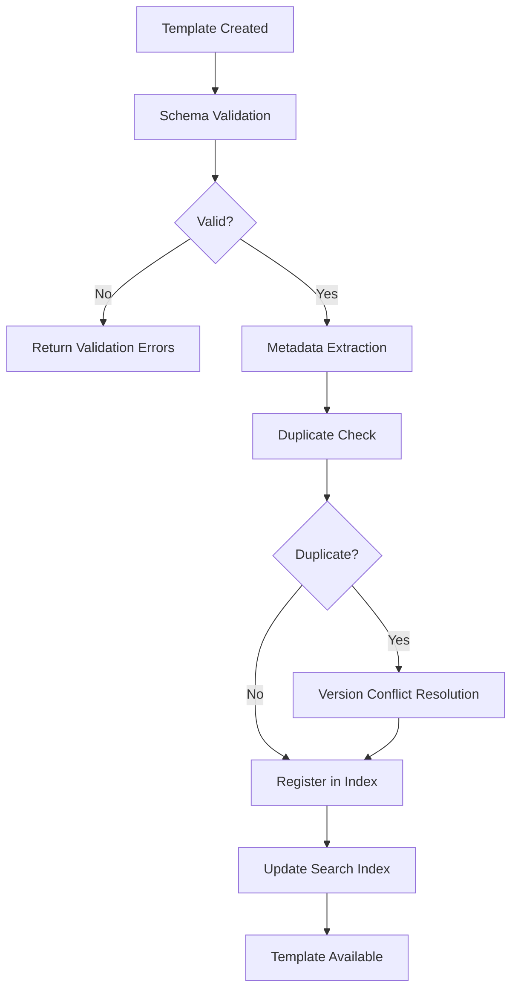
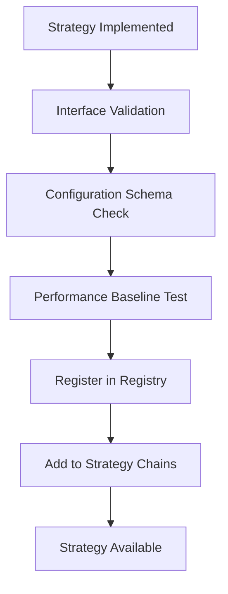

# Prompt Registry System

## 🎯 Overview

The Registry directory contains the prompt registration and discovery system for the LlamaFarm prompts framework. Following the same plugin-based architecture as the universal retrieval strategies, the registry enables automatic discovery, validation, and management of prompt templates and strategies.

## 🏗️ Registry Architecture

The registry system provides:
- **Auto-Discovery**: Automatically find and register prompt templates and strategies
- **Validation**: Ensure templates and strategies meet quality standards
- **Versioning**: Track template versions and manage updates
- **Metadata Management**: Rich metadata for search and categorization
- **Plugin Support**: Easy integration of custom components

## 📁 Directory Structure

```
registry/
├── base.py              # Base registry interfaces (future)
├── template_registry.py # Template registration system (future)
├── strategy_registry.py # Strategy registration system (future)
├── discovery.py         # Auto-discovery mechanisms (future)
├── validation.py        # Template and strategy validation (future)
├── metadata.py          # Metadata management (future)
└── schemas/            # JSON schemas for validation
    ├── template.schema.json
    ├── strategy.schema.json
    └── metadata.schema.json
```

## 🔧 Registry Components

### **Template Registry**
**Purpose**: Manage prompt template lifecycle and discovery
**Responsibilities**:
- Template registration and deregistration
- Version management and migration
- Metadata indexing and search
- Template validation and testing
- Usage tracking and analytics

**Expected Interface**:
```python
class TemplateRegistry:
    def register_template(self, template: PromptTemplate) -> bool
    def get_template(self, template_id: str, version: str = "latest") -> PromptTemplate
    def list_templates(self, filters: Dict = None) -> List[TemplateInfo]
    def validate_template(self, template: PromptTemplate) -> ValidationResult
    def update_template(self, template_id: str, template: PromptTemplate) -> bool
    def deprecate_template(self, template_id: str, reason: str) -> bool
```

### **Strategy Registry**
**Purpose**: Manage prompt selection strategy lifecycle
**Responsibilities**:
- Strategy registration and discovery
- Configuration validation
- Performance monitoring integration
- Strategy composition and chaining
- A/B testing support

**Expected Interface**:
```python
class StrategyRegistry:
    def register_strategy(self, strategy: PromptStrategy) -> bool
    def get_strategy(self, strategy_id: str) -> PromptStrategy
    def list_strategies(self, category: str = None) -> List[StrategyInfo]
    def validate_strategy_config(self, config: Dict) -> ValidationResult
    def create_strategy_chain(self, strategy_ids: List[str]) -> CompositeStrategy
```

## 📋 Registration Process

### **Template Registration Flow**


### **Strategy Registration Flow**


## 🔍 Auto-Discovery System

### **Template Discovery**
The system automatically discovers templates through:
1. **File System Scanning**: Scan template directories for new files
2. **Import Hook Integration**: Detect dynamically imported templates
3. **Configuration Parsing**: Extract templates from configuration files
4. **Plugin System**: Support for external template packages

### **Strategy Discovery**
Strategies are discovered through:
1. **Class Introspection**: Find classes implementing strategy interface
2. **Module Scanning**: Scan strategy directories
3. **Plugin Registration**: External strategy plugins
4. **Dynamic Loading**: Runtime strategy registration

### **Discovery Configuration**
```json
{
  "discovery": {
    "enabled": true,
    "scan_paths": [
      "prompts/templates/",
      "prompts/strategies/",
      "custom_prompts/",
      "plugins/"
    ],
    "file_patterns": ["*.json", "*.yaml", "*.py"],
    "auto_register": true,
    "validation_required": true,
    "update_frequency": "on_startup"
  }
}
```

## ✅ Validation System

### **Template Validation**
```python
class TemplateValidator:
    def validate_structure(self, template: Dict) -> ValidationResult:
        """Validate template structure against schema"""
        
    def validate_variables(self, template: Dict) -> ValidationResult:
        """Ensure all variables are properly defined"""
        
    def validate_metadata(self, template: Dict) -> ValidationResult:
        """Check metadata completeness and accuracy"""
        
    def validate_examples(self, template: Dict) -> ValidationResult:
        """Test template with provided examples"""
        
    def validate_performance(self, template: Dict) -> ValidationResult:
        """Check template performance characteristics"""
```

### **Validation Rules**
```json
{
  "validation_rules": {
    "template": {
      "required_fields": ["template_id", "template", "input_variables"],
      "max_template_length": 10000,
      "max_variables": 20,
      "required_metadata": ["use_case", "complexity", "domain"],
      "example_count": {"min": 1, "max": 10}
    },
    "strategy": {
      "required_methods": ["select_template", "validate_config"],
      "performance_requirements": {
        "max_selection_time_ms": 100,
        "max_memory_mb": 50
      }
    }
  }
}
```

## 📊 Metadata Management

### **Template Metadata Schema**
```json
{
  "template_metadata": {
    "id": "template_unique_id",
    "name": "Human Readable Name",
    "version": "1.0.0",
    "description": "Template description",
    "author": "author_id",
    "created_date": "2024-01-01T00:00:00Z",
    "last_modified": "2024-01-01T00:00:00Z",
    
    "classification": {
      "type": "basic|chat|few_shot|advanced|domain_specific",
      "use_case": ["qa", "summarization", "analysis"],
      "complexity": "low|medium|high",
      "domain": "general|medical|legal|financial|technical",
      "language": "en"
    },
    
    "performance": {
      "avg_tokens": 500,
      "avg_processing_time_ms": 200,
      "quality_score": 0.85,
      "user_satisfaction": 4.2
    },
    
    "usage": {
      "total_invocations": 1000,
      "success_rate": 0.95,
      "last_used": "2024-01-01T00:00:00Z",
      "popularity_score": 0.8
    },
    
    "relationships": {
      "variants": ["template_id_v2", "template_id_fast"],
      "dependencies": ["base_template"],
      "conflicts": ["incompatible_template"]
    }
  }
}
```

### **Strategy Metadata Schema**
```json
{
  "strategy_metadata": {
    "id": "strategy_unique_id",
    "name": "Strategy Name",
    "category": "rule_based|ml_driven|context_aware|performance_optimized",
    "description": "Strategy description",
    
    "capabilities": {
      "supports_domains": ["general", "medical", "legal"],
      "context_factors": ["document_type", "user_expertise"],
      "performance_impact": "low|medium|high",
      "learning_enabled": true
    },
    
    "requirements": {
      "min_templates": 1,
      "required_metadata": ["use_case"],
      "dependencies": ["context_provider"]
    },
    
    "performance": {
      "avg_selection_time_ms": 50,
      "accuracy_score": 0.9,
      "cache_hit_rate": 0.85
    }
  }
}
```

## 🔄 Version Management

### **Template Versioning**
```python
class TemplateVersionManager:
    def create_version(self, template_id: str, version: str) -> bool
    def get_version(self, template_id: str, version: str) -> PromptTemplate
    def list_versions(self, template_id: str) -> List[str]
    def set_default_version(self, template_id: str, version: str) -> bool
    def migrate_version(self, from_version: str, to_version: str) -> MigrationResult
    def deprecate_version(self, template_id: str, version: str) -> bool
```

### **Migration Support**
```json
{
  "migration": {
    "from_version": "1.0",
    "to_version": "2.0",
    "breaking_changes": [
      {
        "change": "variable_renamed",
        "old_name": "user_query",
        "new_name": "question"
      }
    ],
    "migration_script": "migrate_v1_to_v2.py"
  }
}
```

## 🔍 Search and Discovery

### **Template Search Interface**
```python
class TemplateSearch:
    def search_by_text(self, query: str) -> List[TemplateInfo]
    def search_by_metadata(self, filters: Dict) -> List[TemplateInfo]
    def search_by_use_case(self, use_case: str) -> List[TemplateInfo]
    def search_by_domain(self, domain: str) -> List[TemplateInfo]
    def get_recommendations(self, context: Dict) -> List[TemplateInfo]
    def get_similar_templates(self, template_id: str) -> List[TemplateInfo]
```

### **Search Examples**
```python
# Find templates by use case
qa_templates = registry.search_by_use_case("qa")

# Find medical domain templates
medical_templates = registry.search_by_domain("medical")

# Find high-performance templates
fast_templates = registry.search_by_metadata({
    "performance.avg_processing_time_ms": {"$lt": 500}
})

# Get recommendations based on context
recommended = registry.get_recommendations({
    "document_type": "medical",
    "user_expertise": "expert",
    "response_requirements": "detailed"
})
```

## 📈 Analytics and Monitoring

### **Usage Analytics**
```python
class RegistryAnalytics:
    def track_template_usage(self, template_id: str, context: Dict) -> None
    def track_strategy_performance(self, strategy_id: str, metrics: Dict) -> None
    def get_usage_stats(self, template_id: str) -> UsageStats
    def get_popular_templates(self, timeframe: str) -> List[TemplateInfo]
    def get_performance_trends(self, template_id: str) -> PerformanceTrends
```

### **Monitoring Dashboard** (Future)
- Template usage patterns
- Strategy selection effectiveness
- Performance trends
- Error rates and issues
- User satisfaction metrics

## 🚀 Development Roadmap

### **Phase 1: Foundation**
- [ ] Basic registry interfaces
- [ ] Template registration system
- [ ] Simple validation framework
- [ ] File-based discovery

### **Phase 2: Core Features**
- [ ] Strategy registration
- [ ] Metadata management
- [ ] Version control system
- [ ] Search functionality

### **Phase 3: Advanced Features**
- [ ] Auto-discovery system
- [ ] Performance monitoring
- [ ] Analytics dashboard
- [ ] Migration tools

### **Phase 4: Enterprise Features**
- [ ] Multi-tenant registry
- [ ] Advanced security
- [ ] External integrations
- [ ] Automated optimization

## 🤝 Integration with Existing Systems

### **RAG Framework Integration**
```python
# Registry integrates with existing component factories
from core.factories import ComponentFactory
from prompts.registry import TemplateRegistry, StrategyRegistry

# Templates are discovered and registered automatically
template_registry = TemplateRegistry()
strategy_registry = StrategyRegistry()

# Integration with RAG pipeline
pipeline = Pipeline.from_config(config)
pipeline.add_prompt_system(template_registry, strategy_registry)
```

### **CLI Integration**
```bash
# Registry management commands (future)
llamafarm prompts list-templates
llamafarm prompts register-template template.json
llamafarm prompts validate-strategy strategy.py
llamafarm prompts search --use-case qa --domain medical
```

## 🔧 Configuration Integration

### **Registry Configuration**
```json
{
  "prompts": {
    "registry": {
      "enabled": true,
      "auto_discovery": true,
      "validation_strict": true,
      "caching": {
        "enabled": true,
        "ttl_seconds": 3600
      },
      "monitoring": {
        "track_usage": true,
        "performance_metrics": true
      }
    }
  }
}
```

The registry system provides the foundation for a robust, scalable prompt management system that integrates seamlessly with the existing LlamaFarm RAG framework while maintaining the project's core principles of modularity, configurability, and production readiness.