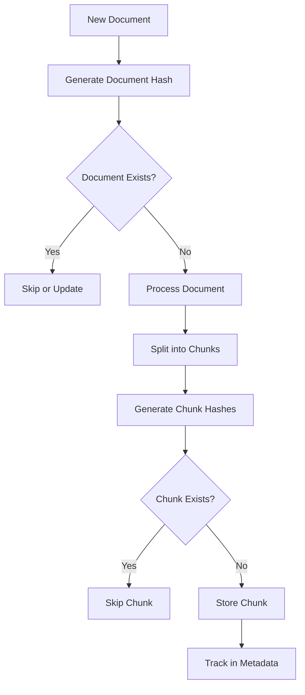

# Deduplication System Documentation

The RAG system implements a comprehensive hash-based deduplication system to prevent duplicate document storage and enable efficient document management.

## Table of Contents

1. [Overview](#overview)
2. [Architecture](#architecture)
3. [Hash Generation](#hash-generation)
4. [Deduplication Process](#deduplication-process)
5. [Document Management](#document-management)
6. [CLI Usage](#cli-usage)
7. [Implementation Details](#implementation-details)
8. [Best Practices](#best-practices)

## Overview

The deduplication system provides:
- **Content-based hashing** for documents and chunks
- **Duplicate prevention** during ingestion
- **Document tracking** for updates and deletions
- **Source file tracking** to prevent re-ingestion
- **Deterministic chunk IDs** for reliable retrieval

### Benefits

- **Storage Efficiency**: Prevent duplicate content storage
- **Data Integrity**: Track document versions and sources
- **Performance**: Faster searches with fewer duplicates
- **Management**: Easy document updates and deletions
- **Consistency**: Deterministic IDs across ingestions

## Architecture

### Two-Level Hashing

The system implements hashing at two levels:

```
Document Level (SHA-256)
    ├── Full document content hash
    ├── Source file tracking
    └── Document-wide operations
    
Chunk Level (SHA-256)
    ├── Individual chunk content hash
    ├── Chunk deduplication
    └── Fine-grained tracking
```

### Component Structure

```python
utils/
└── hash_utils.py
    ├── generate_document_hash()    # Document-level hashing
    ├── generate_chunk_hash()       # Chunk-level hashing
    ├── generate_chunk_id()         # Deterministic ID generation
    ├── generate_document_metadata() # Complete metadata with hashes
    └── DeduplicationTracker        # Track and report duplicates
```

## Hash Generation

### Document Hash

Generated from the complete document content:

```python
def generate_document_hash(content: str) -> str:
    """Generate SHA-256 hash of document content."""
    return hashlib.sha256(content.encode('utf-8')).hexdigest()
```

**Example Output:**
```
document_hash: "a7b3d4e8f9c2b5a1d6e9f3c8b7a4d2e1f9c3b5a8d7e2f4c9b8a5d3e2f7c4b9a6"
```

### Chunk Hash

Generated from individual chunk content:

```python
def generate_chunk_hash(content: str) -> str:
    """Generate SHA-256 hash of chunk content."""
    return hashlib.sha256(content.encode('utf-8')).hexdigest()
```

### Deterministic Chunk ID

Combines document hash, chunk index, and content hash:

```python
def generate_chunk_id(document_hash: str, chunk_index: int, content_hash: str) -> str:
    """Generate deterministic chunk ID."""
    return f"doc_{document_hash[:12]}_chunk_{chunk_index}_{content_hash[:8]}"
```

**Example Output:**
```
chunk_id: "doc_a7b3d4e8f9c2_chunk_0_d6e9f3c8"
```

Format breakdown:
- `doc_` - Prefix for identification
- `a7b3d4e8f9c2` - First 12 chars of document hash
- `chunk_0` - Chunk index (0-based)
- `d6e9f3c8` - First 8 chars of chunk content hash

## Deduplication Process

### During Ingestion



### Metadata Structure

Each chunk includes comprehensive metadata:

```python
{
    # Document-level
    "document_hash": "a7b3d4e8f9c2b5a1d6e9f3c8b7a4d2e1...",
    "source": "/path/to/document.pdf",
    "source_hash": "checksum_of_source_file",
    
    # Chunk-level
    "chunk_id": "doc_a7b3d4e8f9c2_chunk_0_d6e9f3c8",
    "chunk_index": 0,
    "chunk_hash": "d6e9f3c8b7a4d2e1f9c3b5a8d7e2f4c9...",
    "chunk_count": 10,
    
    # Timestamps
    "created_at": "2024-01-15T10:30:00Z",
    "updated_at": "2024-01-15T10:30:00Z",
    
    # Additional metadata
    "file_type": "pdf",
    "file_size": 102400,
    "extraction_method": "PDFParser"
}
```

## Document Management

### Deletion by Document Hash

Delete all chunks from a specific document:

```bash
# CLI command
python cli.py manage delete --document-hashes a7b3d4e8f9c2 --strategy my_strategy

# What happens internally:
1. Query all chunks with matching document_hash
2. Delete all matching chunks
3. Update collection statistics
```

### Deletion by Source Path

Delete all chunks from a specific source file:

```bash
# CLI command
python cli.py manage delete --source-paths /path/to/document.pdf --strategy my_strategy

# What happens internally:
1. Hash the source path
2. Query all chunks with matching source
3. Delete all matching chunks
```

### Replace Document

Replace an existing document with updated content:

```python
# Process:
1. Generate hash of new content
2. If different from existing:
   a. Delete all old chunks (by document_hash)
   b. Ingest new content with new hash
3. If same: Skip (no changes detected)
```

### Duplicate Detection

The DeduplicationTracker monitors and reports duplicates:

```python
tracker = DeduplicationTracker()

# During processing
if chunk_hash in existing_hashes:
    tracker.add_duplicate(chunk_id, chunk_hash, "chunk")
    
# Report results
tracker.print_summary()
# Output:
# ⚠️ Deduplication Summary:
# - Documents: 2 duplicates found (skipped)
# - Chunks: 15 duplicates found (skipped)
# - Storage saved: ~1.2 MB
```

## CLI Usage

### Checking for Duplicates

```bash
# Dry run to check for duplicates without ingesting
python cli.py ingest documents/ --strategy my_strategy --dry-run

# Output will show:
# - Number of duplicate documents
# - Number of duplicate chunks
# - What would be skipped
```

### Managing Duplicates

```bash
# List all unique documents
python cli.py manage list-documents --strategy my_strategy

# Show document details including hash
python cli.py info --strategy my_strategy --show-hashes

# Delete specific document by hash
python cli.py manage delete --document-hashes abc123def456 --strategy my_strategy

# Clean up all duplicates (keeps first occurrence)
python cli.py manage cleanup --duplicates --strategy my_strategy
```

### Preventing Re-ingestion

```bash
# First ingestion
python cli.py ingest file.pdf --strategy my_strategy
# ✅ Document ingested: doc_hash_abc123

# Second ingestion (same file)
python cli.py ingest file.pdf --strategy my_strategy
# ⚠️ Document already exists (hash: abc123), skipping

# Force re-ingestion
python cli.py ingest file.pdf --strategy my_strategy --force
# ✅ Document re-ingested (replaced): doc_hash_abc123
```

## Implementation Details

### Parser Integration

The deduplication system is integrated into all parsers:

```python
# In text_parser.py
from utils.hash_utils import generate_document_metadata

def parse(self, file_path: Path) -> List[Document]:
    content = file_path.read_text()
    
    # Generate comprehensive metadata with hashes
    base_metadata = generate_document_metadata(
        str(file_path), 
        content
    )
    
    # Process chunks
    chunks = self._split_content(content)
    documents = []
    
    for i, chunk in enumerate(chunks):
        chunk_metadata = {
            **base_metadata,
            "chunk_index": i,
            "chunk_id": generate_chunk_id(
                base_metadata["document_hash"],
                i,
                generate_chunk_hash(chunk)
            ),
            "chunk_hash": generate_chunk_hash(chunk),
            "chunk_count": len(chunks)
        }
        
        documents.append(
            Document(content=chunk, metadata=chunk_metadata)
        )
    
    return documents
```

### Store Integration

Vector stores check for duplicates before insertion:

```python
# In chroma_store.py
def add_documents(self, documents: List[Document]) -> List[str]:
    # Check for existing documents
    existing_ids = self._get_existing_ids()
    
    new_documents = []
    skipped = []
    
    for doc in documents:
        if doc.metadata.get("chunk_id") in existing_ids:
            skipped.append(doc.metadata["chunk_id"])
        else:
            new_documents.append(doc)
    
    if skipped:
        logger.info(f"Skipped {len(skipped)} duplicate chunks")
    
    # Add only new documents
    if new_documents:
        return self._add_to_collection(new_documents)
    
    return []
```

### ChromaDB Considerations

ChromaDB-specific handling:

```python
# Filter out None values in metadata
clean_metadata = {}
for key, value in metadata.items():
    if value is not None:
        clean_metadata[key] = value

# ChromaDB doesn't support None values
self.collection.add(
    documents=[doc.content],
    metadatas=[clean_metadata],
    ids=[doc.metadata["chunk_id"]]
)
```

## Best Practices

### 1. Consistent File Paths

Use absolute paths for consistent hashing:

```bash
# Good - absolute path
python cli.py ingest /home/user/documents/file.pdf --strategy my_strategy

# Avoid - relative path (may hash differently)
python cli.py ingest ../documents/file.pdf --strategy my_strategy
```

### 2. Handle Updates Properly

For document updates:

```bash
# Option 1: Delete then re-ingest
python cli.py manage delete --source-paths file.pdf --strategy my_strategy
python cli.py ingest file.pdf --strategy my_strategy

# Option 2: Use force flag (if implemented)
python cli.py ingest file.pdf --strategy my_strategy --force
```

### 3. Monitor Deduplication

Enable verbose output to see deduplication in action:

```bash
python cli.py --verbose ingest documents/ --strategy my_strategy

# Shows:
# - Documents being processed
# - Duplicates detected and skipped
# - Final statistics
```

### 4. Regular Cleanup

Periodically clean up duplicates and orphaned chunks:

```bash
# Weekly cleanup job
python cli.py manage cleanup --duplicates --orphaned --strategy my_strategy
```

### 5. Backup Before Major Operations

Before bulk deletions:

```bash
# Export document list
python cli.py manage export --strategy my_strategy > documents_backup.json

# Perform deletion
python cli.py manage delete --all --strategy my_strategy

# Can restore from backup if needed
```

## Advanced Topics

### Custom Deduplication Logic

Extend the deduplication system for custom needs:

```python
class CustomDeduplicationTracker(DeduplicationTracker):
    def is_duplicate(self, doc: Document) -> bool:
        # Custom logic, e.g., fuzzy matching
        content_hash = generate_chunk_hash(doc.content)
        
        # Check exact match
        if content_hash in self.seen_hashes:
            return True
        
        # Check fuzzy match (example)
        for seen_hash in self.seen_hashes:
            if self.similarity(content_hash, seen_hash) > 0.95:
                return True
        
        return False
```

### Cross-Collection Deduplication

Check for duplicates across multiple collections:

```python
def check_cross_collection_duplicates(doc_hash: str, collections: List[str]):
    duplicates = []
    
    for collection in collections:
        store = ChromaStore(collection_name=collection)
        if store.document_exists(doc_hash):
            duplicates.append(collection)
    
    return duplicates
```

### Deduplication Metrics

Track deduplication effectiveness:

```python
metrics = {
    "total_documents_processed": 1000,
    "duplicates_found": 150,
    "storage_saved_mb": 45.2,
    "dedup_rate": 0.15,
    "processing_time_saved": "5m 30s"
}

print(f"Deduplication saved {metrics['storage_saved_mb']} MB")
print(f"Prevented {metrics['dedup_rate']*100}% redundant processing")
```

## Troubleshooting

### Issue: Duplicates Still Appearing

**Causes:**
- Different file paths for same content
- Content preprocessing differences
- Metadata-only changes

**Solution:**
```bash
# Check document hashes
python cli.py info --strategy my_strategy --show-hashes

# Look for similar hashes
python cli.py manage find-similar --threshold 0.95 --strategy my_strategy
```

### Issue: Legitimate Updates Rejected

**Causes:**
- Content unchanged (only metadata different)
- Hash collision (extremely rare)

**Solution:**
```bash
# Force update
python cli.py manage delete --source-paths file.pdf --strategy my_strategy
python cli.py ingest file.pdf --strategy my_strategy

# Or use timestamp-based updates
python cli.py ingest file.pdf --strategy my_strategy --update-if-newer
```

### Issue: Performance Impact

**Causes:**
- Large number of existing documents
- Duplicate checking overhead

**Solution:**
```python
# Use batch checking
def batch_check_duplicates(documents: List[Document], batch_size: int = 100):
    for i in range(0, len(documents), batch_size):
        batch = documents[i:i+batch_size]
        # Check batch for duplicates
        check_batch(batch)
```

## Future Enhancements

### Planned Features

1. **Fuzzy Deduplication**: Near-duplicate detection using MinHash or SimHash
2. **Content Versioning**: Track document versions and changes
3. **Incremental Updates**: Update only changed chunks
4. **Deduplication API**: REST API for deduplication operations
5. **ML-based Deduplication**: Use embeddings for semantic deduplication

### Configuration Options (Future)

```yaml
deduplication:
  enabled: true
  strategy: "exact"  # exact, fuzzy, semantic
  
  exact:
    algorithm: "sha256"
  
  fuzzy:
    algorithm: "minhash"
    threshold: 0.8
    
  semantic:
    model: "sentence-transformers"
    threshold: 0.9
  
  versioning:
    enabled: true
    max_versions: 5
    
  performance:
    cache_size: 10000
    batch_size: 100
    parallel: true
```

## Related Documentation

- [CLI Guide](../cli/README.md) - CLI commands for deduplication
- [Strategy System](STRATEGY_SYSTEM.md) - Configure deduplication in strategies
- [API Reference](API_REFERENCE.md) - Programmatic deduplication